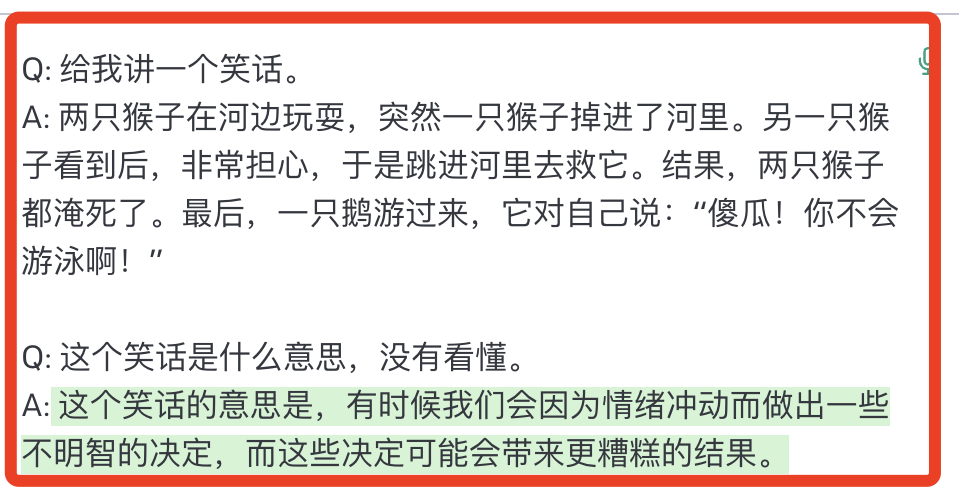

<!-- .slide: data-background-image="assets/chatgpt-bg.jpg" data-background="hsl(0, 0%, 38%)" data-background-opacity="0.36" data-background-size="cover" -->

# ChatGPT 小白教程

 

## 带你从 0 到 1 玩赚人工智能

 

 

#### 松露老师

---

<!-- .slide: data-background="hsl(0,100%,100%)" -->

 

<ul>
<li class="fragment" data-fragment-index="0">
  
Chat：闲聊，聊天

</li>
<li class="fragment" data-fragment-index="1">
  
GPT：Generative Pre-Training Transformer，生成式预训练模型

</li>
</ul>

<blockquote class="fragment" data-fragment-index="2" style="text-align: left;font-size: smaller;color: #2f6f6f;">

🤖 ChatGPT 是一个<strong>人工智能</strong>的问答机器人产品。它可以根据你的提问，生成高质量的回答，比如文章、代码、书信、翻译等。

</blockquote>

---

# ChatGPT 服务

- 回答高质量的问题<!-- .element: class="fragment" style="text-align: left;" -->
- 编写文章、信件、故事<!-- .element: class="fragment" style="text-align: left;" -->
- 提供建议、专家指导<!-- .element: class="fragment" style="text-align: left;" -->
- 外文翻译、语法纠错<!-- .element: class="fragment" style="text-align: left;" -->
- more...<!-- .element: class="fragment" style="text-align: left;" -->

---

<!-- .slide: data-background="hsl(0,100%,100%)" -->

### 回答问题

--·--

<!-- .slide: data-background="hsl(0,100%,100%)" -->

### 生成文案

--·--

<!-- .slide: data-background="hsl(0,100%,100%)" -->

### 提供建议

--·--

<!-- .slide: data-background="hsl(0,100%,100%)" -->

### 翻译外文

--·--

<!-- .slide: data-background="hsl(0,100%,100%)" -->

## 编写故事

---

## 真实案例

- ChatGPT 已通过 MBA 考试、美国执业医师资格考试、斯坦福大学医学院临床推理期末考试。<!-- .element: class="fragment fade-in-then-semi-out	" style="text-align: left;" -->
- ChatGPT 代福尔曼大学一哲学系学生写了一篇论文，文章中有“写得很好的错误信息”。<!-- .element: class="fragment fade-in-then-semi-out	" style="text-align: left;" -->
- ChatGPT 已经通过谷歌 L3 级别程序员的面试，拿下 18 万美元的 Offer。<!-- .element: class="fragment fade-in-then-semi-out	" style="text-align: left;" -->
- 以色列总统艾萨克·赫尔佐格（Isaac Herzog）在周三发表了一篇演讲，这篇演讲中，部分内容是由 AI 创作的。<!-- .element: class="fragment fade-in-then-semi-out	" style="text-align: left;" -->

---

<!-- .slide: data-background="hsl(0,100%,100%)" -->

#### 一个产品达到一亿用户量，需要多久？

 

- 电话需要 75 年<!-- .element: class="fragment" style="text-align: left;" -->
- 手机需要 16 年<!-- .element: class="fragment" style="text-align: left;" -->
- 互联网需要 7 年<!-- .element: class="fragment" style="text-align: left;" -->
- Twitter 需要 5 年<!-- .element: class="fragment" style="text-align: left;" -->
- TikTok 需要 9 个月<!-- .element: class="fragment" style="text-align: left;" -->
- ChatGPT 需要 2 个月<!-- .element: class="fragment" style="text-align: left;" -->

---

<!-- .slide: data-background-image="assets/chatgpt-bg.jpg" data-background="hsl(0, 0%, 38%)" data-background-opacity="0.36" data-background-size="cover" -->

# 未来以来<!-- .element: class="fragment" -->

## 你准备好了吗？<!-- .element: class="fragment" -->
