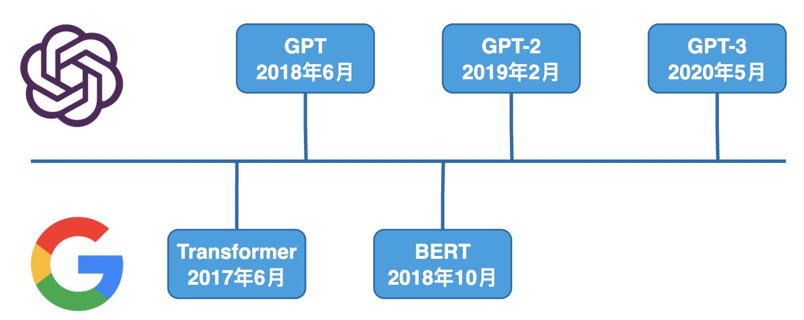

<h1 class="article-title no-number">ChatGPT概述</h1>

# ChatGPT 简介

ChatGPT 它就是智能的**对话聊天工具**，由美国“开放人工智能研究中心”（OpenAI）研发。

- Chat：闲聊，聊天
- GPT：「Generative Pretrained Transformer」的缩写，是一种预训练语言模型，旨在通过机器学习大量语料来生成合理的文本，如撰写文章、机器翻译、阅读理解、智能问答等。它是由 OpenAI 公司开发的，目前已经有多个版本，如GPT、GPT-2 和 GPT-3。

关于ChatGPT，以下是它自己的回答：ChatGPT 是一种基于自然语言处理（NLP）的聊天机器人技术，它使用 GPT-3 模型来生成自然语言回复。ChatGPT 可以帮助企业提高客户服务水平，提供更快捷、更准确的客户服务。

总结一句话，ChatGPT是一个**人工智能**的问答机器人，可以根据你的提问，生成高质量的回答。

# 了解GPT

GPT (Generative Pre-trained Transformer) 是一种**自然语言生成模型**，由 OpenAI 开发。它是基于 Transformer 模型，并通过大量预训练数据进行训练。

这一系列模型在复杂NLP（Natural Language Processing，自然语言处理）方面有着惊艳的效果，例如：文章生成、代码编写、语音识别和机器翻译等。

## GPT 简介

2018 年 6 月，OpenAI 发表论文介绍了自己的语言模型——GPT，即「Generative Pre-Training Transformer」。

GPT 使用了注意力机制的 Transformer 模型的结构。其工作原理是，先在大规模语料上进行无监督预训练（Pre-training），然后在小得多的有监督数据集上为具体任务进行精细调节（Fine-tune）的方式。**简单来说，就是通过读取训练数据中的大量文本，并学习语言模式和语法，然后根据这些学到的知识生成新的文本。**

总的来说，**GPT 是一种通过读取大量文本数据并学习语言模式来生成文本的模型**。它的预训练方法使其**能够生成高质量的文本**，并且能够应用于**多种自然语言处理任务**，如文章生成、代码编写、语音识别和机器翻译等。

## GPT的前世今生

- Transformer：继MLP、CNN、RNN后的第四大类架构
- GPT：OpenAI团队使用 Transformer 解码器来做预训练模型
- BERT：Transformer一统NLP的开始
- GPT-2：更大的 GPT 模型，朝着zero-shot learning迈了一大步
- GPT3：100倍的GPT-2模型，在few-shot learning上效果显著

如此强大的功能，并不是一个简单的语言模型就可以搞定的。GPT模型迭代了三代，通过不断提高训练参数量和训练预料，使其最终能够生成高质量的文本内容。

- 2018 年，OpenAI 采用 Transformer Decoder 结构在大规模语料上训练了 GPT1 模型，并能够完成**特定的 NLP 任务**。 
- 2019 年，提出了 GPT2，GPT2 拥有和 GPT1 一样的模型结构，得益于更高的数据质量和更大的数据规模以及创造性的引入**多任务学习模式**，能够完成包括**对话**、**翻译**等各种 NLP 任务。
- 2020 年，OpenAI 提出 GPT3 将 GPT 模型提升到全新的高度，其训练参数超 1750 亿，训练语料达到了 45TB 之多，**暴力出奇迹**，开启了**超大模型**时代，并在预训练+微调的基础上创造性的引入了情境学习模式，将人为提示作为语料输入。

| 模型  | 发表时间     | 参数量  | 预训练数据量 | 数据集来源                                                |
| ----- | ------------ | ------- | ------------ | --------------------------------------------------------- |
| GPT   | 2018 年 6 月 | 1.17 亿 | 5GB          | 未出版的书籍                                              |
| GPT-2 | 2019 年 2 月 | 15 亿   | 40GB         | Reddit上800万篇高赞文章                                   |
| GPT-3 | 2020 年 5 月 | 1750 亿 | 45TB         | Common Crawl(filtered)、Books、Reddit Links、Wikipedia... |

## GPT3的特性

- **海量规模数据集**：使用了巨大的文本数据进行训练，拥有超过 175 亿的参数，是目前世界上最大的语言模型。
- **高质量文本生成能力**：可以生成各种高质量的文本，包括短信、对话、诗歌等。可以用于智能问答系统、聊天机器人、语音识别、文本生成等。
- **保持文本的连贯性和一致性**：生成文本时保持语言的连贯性和一致性，极大地提高了文本的可读性和可理解性，很大程度上提高了人工智能的生成能力。
- **强大的多语言能力**：能够在不同语言间进行互相理解。这对于机器翻译和语音合成等多语言应用具有极大的影响。

总的来说，GPT-3 可以帮助我们自动完成一些**复杂的任务**，**提高工作效率**，**改善工作质量**，对我们的生活和工作产生深远影响。

GPT-3 的出现标志着人工智能的一个新的里程碑，它将为人工智能的更广泛应用铺平道路，推动人工智能技术的更快发展。

## GPT3 的影响

- **潜在的风险应用**：可能利用GPT3生成不是内容，如散播虚假新闻、论文造假等。
- **产生偏见**：对一些群体、种族、宗教等生成的评价可能比较负面。
- **能耗巨大**：需要大量的计算资源和存储空间，小型公司和个人用户无法承担巨大的成本。

因此，在 GPT-3 的技术发展过程中，需要不断加以完善和改进，以确保其安全、可靠、合法和道德。

# ChatGPT 应用场景

Chat GPT 是 GPT 的一个应用，旨在构建聊天机器人。其高效的语言生成能力和人类般的语言表达方式，在聊天机器人领域具有广泛的应用前景。

ChatGPT 能够做的事情很多，比如：

- 回答问题：能够通过文字回答问题，为用户提供信息。
- 提供建议：能够根据用户的需求提供专业的建议。
- 计算数学问题：能够快速准确地计算简单的数学问题。
- 翻译文本：能够快速准确地翻译文本，让用户更好地理解内容。
- 生成文本：能够根据提供的信息生成文本，为用户提供更多信息。
- 写作：能够根据用户的需求进行写作，为用户提供高质量的文字内容。
- 提供知识：能够根据用户的需求提供专业的知识，为用户提供更多信息。
- 提供解决方案：能够根据用户提出的问题提供解决方案，帮助用户解决实际问题。
- 提供娱乐：能够根据用户的需求提供娱乐内容，为用户提供欢乐和放松。
- 聊天：能够通过文字和用户进行交流，提供娱乐和放松。
