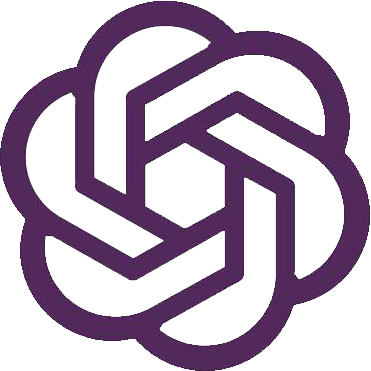

<h1 class="article-title no-number">第一章 ChatGPT概述</h1>

# 什么是 GPT

2018 年 6 月，OpenAI 发表论文介绍了自己的语言模型——GPT，即「Generative Pre-Training Transformer」。

> Generative Pre-Training Transformer：生成预训练

GPT 使用了注意力机制的 Transformer 模型的结构。其工作原理是，先在大规模语料上进行无监督预训练（Pre-training），然后在小得多的有监督数据集上为具体任务进行精细调节（Fine-tune）的方式。**简单来说，就是通过读取训练数据中的大量文本，并学习语言模式和语法，然后根据这些学到的知识生成新的文本。**

总的来说，**GPT 是一种通过读取大量文本数据并学习语言模式来生成文本的模型**。它的预训练方法使其**能够生成高质量的文本**，并且能够应用于**多种自然语言处理任务**，如文章生成、代码编写、语音识别和机器翻译等。

# 神秘的 OPENAI

OPENAI（开放人工智能）是美国一个人工智能研究实验室，目的是促进和发展友好的人工智能，使人类整体受益。

- 创立时间：2015 年 12 月 11 日
- 创始人：
  - 山姆·柯曼：斯坦福大学计算机科学专业（辍学），犹太人。
  - 伊尔亚·苏茨克维：加拿大计算机科学家，发明卷积神经网络 AlexNet，谷歌 AlphaGo 论文作者之一，谷歌大脑首席科学家。
  - 伊隆·马斯克：美国工程院院士、SpaceX 创始人、特斯拉及推特 CEO。
- 发展历程：
  - 2015 年底，OpenAI 成立，总部位于加利福尼亚州旧金山，组织目标是通过与其他机构和研究者的“自由合作”，**向公众开放专利和研究成果**。
  - 2016 年，OpenAI 宣称将制造“通用”机器人，希望能够预防人工智能的灾难性影响，推动人工智能发挥积极作用。
  - 2019 年 7 月 22 日微软投资 OpenAI 10 亿美元，并在
  - 2020 年 6 月 11 日宣布了 GPT-3 语言模型，微软于 2020 年 9 月 22 日获取独家授权。
  - 2021 年，微软再次投资 10 亿美元，并继续与 ChatGPT 独家合作，在微软 Azure 云数据中心训练其 AI 模型。
  - 2022 年 11 月 30 日，OpenAI 发布了一个名为 ChatGPT 的自然语言生成式模型，2 个月时间用户量破亿，被谷歌称为「**红色代码**」。

> 如果让我猜人类最大生存威胁，我认为可能是人工智能。因此我们需要对人工智能保持万分警惕，研究人工智能如同在召唤恶魔。——伊隆·马斯克

# GPT 的前世今生

如此强大的功能，并不是一个简单的语言模型就可以搞定的。GPT 模型迭代了三代，通过不断提高训练参数量和训练预料，使其最终能够生成高质量的文本内容。

- 2018 年，OpenAI 采用 Transformer Decoder 结构在大规模语料上训练了 GPT 模型，并能够完成**特定的 NLP 任务**。
- 2019 年，提出了 GPT2，GPT2 拥有和 GPT1 一样的模型结构，更大的 GPT 模型，朝着 zero-shot learning 迈了一大步，得益于更高的数据质量和更大的数据规模以及创造性的引入**多任务学习模式**，能够完成包括**对话**、**翻译**等各种 NLP 任务。
- 2020 年，OpenAI 提出 GPT3 将 GPT 模型提升到全新的高度，其训练参数超 1750 亿，训练语料达到了 45TB 之多，100 倍的 GPT-2 模型，在 few-shot learning 上效果显著，**暴力出奇迹**，开启了**超大模型**时代，并在预训练+微调的基础上创造性的引入了情境学习模式，将人为提示作为语料输入。

| 模型  | 发表时间     | 参数量  | 预训练数据量 | 数据集来源                                                |
| ----- | ------------ | ------- | ------------ | --------------------------------------------------------- |
| GPT   | 2018 年 6 月 | 1.17 亿 | 5GB          | 未出版的书籍                                              |
| GPT-2 | 2019 年 2 月 | 15 亿   | 40GB         | Reddit 上 800 万篇高赞文章                                |
| GPT-3 | 2020 年 5 月 | 1750 亿 | 45TB         | Common Crawl(filtered)、Books、Reddit Links、Wikipedia... |

# GPT3 的特点及局限

GPT3 的主要特点是：

- **海量规模数据集**：使用了巨大的文本数据进行训练，拥有超过 175 亿的参数，是目前世界上最大的语言模型。
- **高质量文本生成能力**：可以生成各种高质量的文本，包括短信、对话、诗歌等。可以用于智能问答系统、聊天机器人、语音识别、文本生成等。
- **保持文本的连贯性和一致性**：生成文本时保持语言的连贯性和一致性，极大地提高了文本的可读性和可理解性，很大程度上提高了人工智能的生成能力。
- **强大的多语言能力**：能够在不同语言间进行互相理解。这对于机器翻译和语音合成等多语言应用具有极大的影响。

总的来说，GPT-3 可以帮助我们自动完成一些**复杂的任务**，**提高工作效率**，**改善工作质量**，对我们的生活和工作产生深远影响。

GPT-3 的出现标志着人工智能的一个新的里程碑，它将为人工智能的更广泛应用铺平道路，推动人工智能技术的更快发展。

除此之外，GPT3 还有着局限性，比如：

- **潜在的风险应用**：可能利用 GPT3 生成不实内容，如散播虚假新闻、论文造假等。
- **产生偏见**：对一些群体、种族、宗教等生成的评价可能比较负面。
- **能耗巨大**：需要大量的计算资源和存储空间，小型公司和个人用户无法承担巨大的成本。

因此，在 GPT-3 的技术发展过程中，需要不断加以完善和改进，以确保其安全、可靠、合法和道德。

# 什么是 ChatGPT

ChatGPT 是基于 GPT-3 的应用，它就是智能的**对话聊天工具**。

关于「什么是 ChatGPT？」这个问题，以下是它自己的回答：

> ChatGPT 是一种基于自然语言处理（NLP）的聊天机器人技术，它使用 GPT-3 模型来生成自然语言回复。ChatGPT 可以帮助企业提高客户服务水平，提供更快捷、更准确的客户服务。
>
> 

总结一句话，ChatGPT 是一个**人工智能**的问答机器人，可以根据你的提问，生成高质量的回答。

# ChatGPT 特点

让我们看一组数据，一个产品要达到全球 1 亿用户所需时间：

| 产品        | 时间   |
| ----------- | ------ |
| 电话        | 75 年  |
| 手机        | 16 年  |
| 互联网      | 7 年   |
| Twitter     | 5 年   |
| Apple Store | 2 年   |
| TikTok      | 9 个月 |
| ChatGPT     | 2 个月 |

两个月时间，ChatGPT 席卷全球，甚至有人开始发布舆论：**ChatGPT 会摧毁一切**！

谷歌甚至将其命名为「红色代码」，国内各大互联网公司也迅速响应内测，迎接火爆的风口。

可以预见的是，ChatGPT 未来会持续加热、未来一年、未来两年...

在未来，ChatGPT 或许会让很多中低端重复工作的人失业，但会使用和操纵 AI 工具的人不会，熟练掌握 ChatGPT 工具的我们不会。机器人再厉害，也要由人来进行调教，而我们人类就是它的驯兽师。

# ChatGPT 功能

ChatGPT 是 GPT-3.5 的一个应用，旨在构建聊天机器人。其高效的语言生成能力和人类般的语言表达方式，在聊天机器人领域具有广泛的应用前景。

ChatGPT 的回答更符合人类的对话习惯，能够做的事情很多，比如：

## 回答问题

能够通过文字回答问题，为用户提供信息。

## 生成文本

能够根据用户的需求进行写作，为用户提供高质量的文字内容。

## 提供建议

能够根据用户的需求提供专业的建议、知识和解决方案。

## 翻译文本

能够快速准确地翻译文本，让用户更好地理解内容。

## 提供娱乐

能够根据用户的需求提供娱乐内容，为用户提供欢乐和放松。

# ChatGPT 案例

- ChatGPT 已通过沃顿商学院 MBA 考试、美国执业医师资格考试、明尼苏达大学四门课程的考试、斯坦福大学医学院临床推理期末考试。
- 福尔曼大学的一位哲学教授发现一名学生交上了一篇 AI 代写的作文，发现文章中有“写得很好的错误信息”。
- ChatGPT 已经通过谷歌 L3 级别程序员的面试，拿下 18 万美元的 Offer。
- 据耶路撒冷邮报报道，以色列总统艾萨克·赫尔佐格（Isaac Herzog）在周三发表了一篇演讲，这篇演讲中，部分内容是由 AI 创作的。

- 有人已经开始使用 ChatGPT 写出来的营销软文，比原有效率提升了 5 倍。
- 有小团队，已经批量售卖 ChatGPT 写出来的 Paper，产量很高。
- 做抖音直播的团队，直播间销售话术是 ChatGPT 写的。
- 做天猫电商的买家，在线客服的接待是 ChatGPT。
- ... ...

由此可见，ChatGPT 上至天文地理，下晓鸡毛蒜皮。
