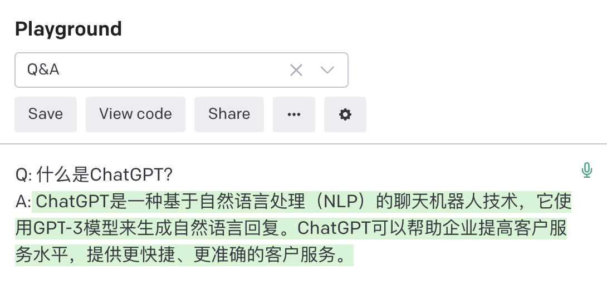
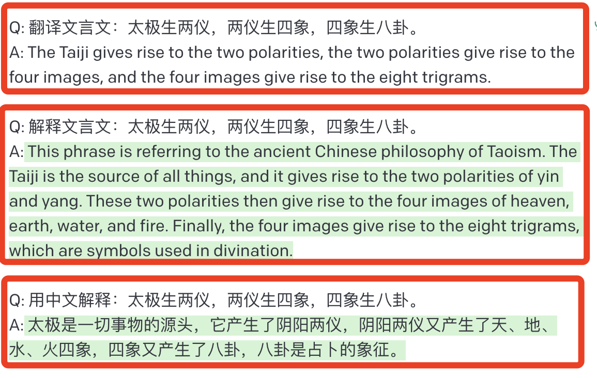

<h1 class="article-title no-number">第一章 ChatGPT概述</h1>

# 什么是 GPT

2018 年 6 月，OpenAI 发表论文介绍了自己的语言模型——GPT，即「Generative Pre-Training Transformer」。

> Generative Pre-Training Transformer，生成式的预训练，这是什么意思呢？我们来看 GPT 自己给出的回答吧！
>
> 
>
> 

GPT 使用了注意力机制的 Transformer 模型的结构。其工作原理是，先在大规模语料上进行**无监督预训练**（Pre-training），然后在小得多的**有监督数据集**上为具体任务进行精细调节（Fine-tune）的方式。

**简单来说，就是通过读取训练数据中的大量文本，并学习语言模式和语法，然后根据这些学到的知识生成新的文本。**

总的来说，**GPT 是一种通过读取大量文本数据并学习语言模式来生成文本的模型**。它的预训练方法使其**能够生成高质量的文本**，并且能够应用于**多种自然语言处理任务**，如文章生成、代码编写、语音识别和机器翻译等。

# 神秘的 OPENAI

OPENAI（开放人工智能）是美国一个人工智能研究实验室，目的是促进和发展友好的人工智能，使人类整体受益。

- **创立时间**：2015 年 12 月 11 日
- **创始人**
  - 山姆·柯曼：斯坦福大学计算机科学专业（辍学），犹太人。
  - 伊尔亚·苏茨克维：加拿大计算机科学家，发明卷积神经网络 AlexNet，谷歌 AlphaGo 论文作者之一，谷歌大脑首席科学家。
  - 伊隆·马斯克：美国工程院院士、SpaceX 创始人、特斯拉及推特 CEO。
- **发展历程**
  - 2015 年底，OpenAI 成立，总部位于加利福尼亚州旧金山，组织目标是通过与其他机构和研究者的“自由合作”，**向公众开放专利和研究成果**。
  - 2016 年，OpenAI 宣称将制造“通用”机器人，希望能够预防人工智能的灾难性影响，推动人工智能发挥积极作用。
  - 2018 年 6 月，OpenAI 基于 Transformer 解码器，开发了 GPT（也叫 GPT-1）语言模型。
  - 2019 年 7 月 22 日微软投资 OpenAI 10 亿美元。
  - 2020 年 6 月 11 日宣布了 GPT-3 语言模型，微软于 2020 年 9 月 22 日获取独家授权。
  - 2021 年，微软再次投资 10 亿美元，并继续与 ChatGPT 独家合作，在微软 Azure 云数据中心训练其 AI 模型。
  - 2022 年 11 月 30 日，OpenAI 发布了一个名为 ChatGPT 的自然语言生成式模型，2 个月时间用户量破亿，被谷歌称为「**红色代码**」。

> 如果让我猜人类最大生存威胁，我认为可能是人工智能。因此我们需要对人工智能保持万分警惕，研究人工智能如同在召唤恶魔。——伊隆·马斯克

# GPT 的前世今生

如此强大的功能，并不是一个简单的语言模型就可以搞定的。GPT 模型迭代了三代，通过不断提高训练参数量和训练预料，使其最终能够生成高质量的文本内容。

- 2018 年，OpenAI 采用 Transformer Decoder 结构在大规模语料上训练了 GPT 模型，并能够完成**特定的 NLP 任务**。
- 2019 年，提出了 GPT2，GPT2 拥有和 GPT1 一样的模型结构，更大的 GPT 模型，朝着 **zero-shot learning** 迈了一大步，得益于更高的数据质量和更大的数据规模以及创造性的引入**多任务学习模式**，能够完成包括**对话**、**翻译**等各种 NLP 任务。
- 2020 年，OpenAI 提出 GPT3 将 GPT 模型提升到全新的高度，其训练参数超 1750 亿，训练语料达到了 45TB 之多，100 倍的 GPT-2 模型，在 **few-shot learning** 上效果显著。所谓**暴力出奇迹**，GPT-3 开启了**超大模型**时代，并在预训练+微调的基础上创造性的引入了情境学习模式，将人为提示作为语料输入。

> **下游任务**
>
> - zero-shot：根据提示（暗示）来输出，比如，生成一个小红书文案。
> - one-shot：给它一个例子，来生成答案。比如，给它一个小红书文案的例子，让它仿照来生成文案。
> - few-shot：给它几个例子，来生成答案。比如，给它几个爆款小红书文案，它会模仿自动生成文案，这样生成的文案就会更加多样性。

| 模型  | 发表时间     | 参数量  | 预训练数据量 | 数据集来源                                                |
| ----- | ------------ | ------- | ------------ | --------------------------------------------------------- |
| GPT   | 2018 年 6 月 | 1.17 亿 | 5GB          | 未出版的书籍                                              |
| GPT-2 | 2019 年 2 月 | 15 亿   | 40GB         | Reddit 上 800 万篇高赞文章                                |
| GPT-3 | 2020 年 5 月 | 1750 亿 | 45TB         | Common Crawl(filtered)、Books、Reddit Links、Wikipedia... |

由此可见，第一代、第二代的 GPT 并没有太多的亮点，直到 GPT-3，才真正是“**暴力出奇迹**”，逐渐受到大众的注意。

> 2022 年 GPT-3 未开放时的粗略统计：
>
> - 预计每天产生 45 亿字内容
> - 几乎每一小时生成 100w 本书
>
> 以后我们所见、所读、所听、所想，都还是真的吗？

# GPT3 的特点及局限

GPT3 的主要特点是：

- **海量规模数据集**：使用了巨大的文本数据进行训练，拥有超过 1750 亿的参数，是目前世界上最大的语言模型。
- **高质量文本生成能力**：可以生成各种高质量的文本，包括短信、对话、诗歌等。可以用于智能问答系统、聊天机器人、语音识别、文本生成等。
- **保持文本的连贯性和一致性**：生成文本时保持语言的连贯性和一致性，极大地提高了文本的可读性和可理解性，很大程度上提高了人工智能的生成能力。
- **强大的多语言能力**：能够在不同语言间进行互相理解。这对于机器翻译和语音合成等多语言应用具有极大的影响。

总的来说，GPT-3 可以帮助我们自动完成一些**复杂的任务**，**提高工作效率**，**改善工作质量**，对我们的生活和工作产生深远影响。

GPT-3 的出现标志着人工智能的一个新的里程碑，它将为人工智能的更广泛应用铺平道路，推动人工智能技术的更快发展。

除此之外，GPT3 还有着局限性，比如：

- **潜在的风险应用**：可能利用 GPT3 生成不实内容，如散播虚假新闻、论文造假等。

- **存在偏见**：由于数据来源于网络，所以对一些群体、种族、宗教等生成的评价可能比较负面。

- **所问非所答**：答案可能并不是在约束条件中，可能会自作聪明发散回答。你说前门楼子，它说胯胯轴子。虽然 ChatGPT 生成文本的能力强大，但是仍然没有通过图灵测试。

> **图灵测试**
>
> 
>
> 1966 年，麻省理工学院（MIT）的教授**约瑟夫·维森鲍姆**发明了一个可以和人对话的程序，名为 Eliza。
>
> Eliza 被设计成一个心理治疗师，可以通过谈话帮助有心理疾病的病人。当时的人们十分惊讶，因为 Eliza 能够像真人一样与人交流几十分钟。但实际上这个程序并没有达到真正的智能，它用了一些语言技巧来装作自己理解了对方说的话。例如下面一段对话，模拟了当时 Eliza 和患者的对话程序。
>
> - Eliza: “我是心理治疗师，请问有什么问题。每次说完话，请按两次回车键。”
> - 患者：“你好吗？”
> - Eliza：“还不错，跟我讲讲你自己。”
> - 患者：“我感觉好孤独，好忧伤。”
> - Eliza：“为什么你感觉好孤独，好忧伤？”
> - 患者：“家人和朋友都不关心我。”
> - Eliza：“跟我讲讲你的家庭。”
> - ......
>
> 这段对话可以明显感觉到其实 Eliza 并不能理解患者说的话然后进行回应，而是在用引导性的话让这段对话延续下去。现在流行的**微软小冰**、**苹果 Siri**、**谷歌 Allo**以及**亚马逊 Alexa**都是运用了类似的语言技巧，它们都是 Eliza 的现代加强版。它们给人感觉已经基本能与人沟通了，但是离真正的人工智能还是有所差距。
>
> 图灵测试里，有一项非常有效的测试，**就是不停地问对方同样的问题**，看对方什么反应。比如，不断地问：你是你妈生的吗？问很多很多遍，如果对方总是不急不慢很有耐心的回答你这同一个问题，那么对话的多半是个聊天程序了。

- **能耗巨大**：需要大量的计算资源和存储空间，小型公司和个人用户无法承担巨大的成本。

> 据悉，团队利用 Carbontracker 对当前最火热的人工智能语言模型 GPT-3 进行了测算。经测算，在使用 Nvidia GPU 集群组成的微软超算数据中心中**训练一次 GPT-3 模型消耗的电量**约为 19 万度，按照美国的碳排放标准计算大约产生了 85000 kg 的二氧化碳当量，**相当于一辆汽车行驶 70 万公里（大约是地球与月球之间距离的两倍）的排放量**。

因此，在 GPT-3 的技术发展过程中，需要不断加以完善和改进，以确保其安全、可靠、合法和道德。

# 什么是 ChatGPT

ChatGPT 是基于 GPT-3 的应用，它就是智能的**对话聊天工具**。

关于「什么是 ChatGPT？」这个问题，以下是它自己的回答：

> ChatGPT 是一种基于自然语言处理（NLP）的聊天机器人技术，它使用 GPT-3 模型来生成自然语言回复。ChatGPT 可以帮助企业提高客户服务水平，提供更快捷、更准确的客户服务。
>
> 

总结一句话，ChatGPT 是一个**人工智能**的问答机器人，可以根据你的提问，生成高质量的回答。

# ChatGPT 特点

让我们看一组数据，一个产品要达到全球 1 亿用户所需时间：

| 产品        | 时间   |
| ----------- | ------ |
| 电话        | 75 年  |
| 手机        | 16 年  |
| 互联网      | 7 年   |
| Twitter     | 5 年   |
| Apple Store | 2 年   |
| TikTok      | 9 个月 |
| ChatGPT     | 2 个月 |

两个月时间，ChatGPT 席卷全球，甚至有人开始发布舆论：**ChatGPT 会摧毁一切**！

谷歌甚至将其命名为「红色代码」，国内各大互联网公司也迅速响应内测，迎接火爆的风口。

可以预见的是，ChatGPT 未来会持续加热、未来一年、未来两年...

在未来，ChatGPT 或许会让很多中低端重复工作的人失业，但会使用和操纵 AI 工具的人不会，熟练掌握 ChatGPT 工具的我们不会。机器人再厉害，也要由人来进行调教，而我们人类就是它的驯兽师。

# ChatGPT 服务

ChatGPT 是 GPT-3.5 的一个应用，旨在构建聊天机器人。其高效的语言生成能力和人类般的语言表达方式，在聊天机器人领域具有广泛的应用前景。

ChatGPT 的回答更符合人类的对话习惯，能够做的事情很多，比如：

## 回答问题

能够通过文字回答问题，为用户提供信息。

## 生成文本

能够根据用户的需求进行写作，为用户提供高质量的文字内容。

## 提供建议

能够根据用户的需求提供专业的建议、知识和解决方案。

## 翻译文本

能够快速准确地翻译文本，让用户更好地理解内容。

## 提供娱乐

能够根据用户的需求提供娱乐内容，为用户提供欢乐和放松。

# ChatGPT 实用功能

| 类别         | 描述                                                                                                                                                               |
| ------------ | ------------------------------------------------------------------------------------------------------------------------------------------------------------------ |
| 学术论文     | 它可以写各种类型的学术论文，包括科技论文、文学论文、社科论文等。它可以帮助你进行研究、分析、组织思路并编写出符合学术标准的论文。                                   |
| 创意写作     | 它可以写小说、故事、剧本、诗歌等创意性的文学作品，能够在描述情节和角色方面提供帮助。                                                                               |
| 内容创作     | 它可以写 SEO 文章、博客文章、社交媒体帖子、产品描述等各种类型的内容创作。它能够为你提供有趣、独特、易读的内容，帮助你吸引读者和提升品牌知名度。                    |
| 商业写作     | 它可以帮助你编写商业计划书、市场调研报告、营销策略、商业简报、销售信件等。它可以用清晰、精炼的语言向你的潜在客户或投资者传达你的信息。                             |
| 学术编辑     | 它可以帮助你进行学术论文、研究报告、学位论文等的编辑和校对工作，确保文本的正确性、一致性和完整性，并提供改进建议。                                                 |
| 翻译         | 它可以进行英语和中文之间的翻译工作，包括但不限于学术文献、商业文档、网站内容、软件界面等。它可以保证翻译的准确性和专业性。                                         |
| 数据分析     | 它可以帮助你进行各种类型的数据分析，包括统计分析、文本分析、数据可视化等。它可以使用 Python、R 等工具来分析你的数据，并提供数据报告和可视化结果。                  |
| 技术文档     | 它可以编写各种类型的技术文档，包括用户手册、技术规范、API 文档、代码注释等。它可以使用清晰、准确、易懂的语言描述你的技术产品和流程。                               |
| 教育培训     | 它可以编写各种类型的教育培训材料，包括课程大纲、课件、教学指南、教育评估等。它可以帮助你设计课程内容和教学方法，并为你制定适合你目标受众的培训计划。               |
| 网站内容     | 它可以编写网站的各种类型内容，包括首页、关于我们、服务介绍、博客文章等。它可以根据你的品牌和目标读者为你提供优质、富有吸引力的内容。                               |
| 研究咨询     | 它可以帮助你进行研究、提供咨询意见和建议。它可以进行文献综述、研究设计、数据分析等工作，为你提供高质量、可靠的研究结果和建议。                                     |
| 演讲稿       | 它可以帮助你编写演讲稿、PPT 等，包括商业演讲、学术演讲、庆典致辞等。它可以根据你的主题、目标听众和场合为你编写一份有说服力、生动有趣的演讲稿。                     |
| 个人陈述     | 它可以帮助你编写个人陈述，包括申请大学、研究生、博士生、奖学金、工作等的个人陈述。它可以帮助你展现你的优势和价值观，并提供专业的写作建议。                         |
| 简历和求职信 | 它可以帮助你编写简历和求职信，帮助你突出你的技能和经验，并为你提供吸引雇主和 HR 的技巧和建议。                                                                     |
| 广告文案     | 它可以编写各种类型的广告文案，包括产品广告、服务广告、品牌广告、活动宣传等。它可以为你编写具有吸引力、清晰明了的广告文案，让你的目标受众更容易接受你的产品或服务。 |
| SEO 优化     | 它可以帮助你优化你的网站、文章或其他内容的 SEO。它可以使用关键词研究、内容优化等技术，帮助你提高排名、获得更多的流量和转换率。                                     |
| 社交媒体     | 它可以为你编写社交媒体内容，包括微博、脸书、Instagram 等。它可以帮助你设计吸引人的标题、内容和图片，并为你提供有用的社交媒体营销策略。                             |
| 新闻稿       | 它可以帮助你编写新闻稿，包括公司新闻、产品发布、重大事件等。它可以为你编写新闻稿、编辑和发布，以吸引媒体关注并提高品牌知名度。                                     |
| 多语言翻译   | 它可以提供各种语言之间的翻译服务，包括英文、中文、法文、德文、西班牙文、俄文等。它可以翻译各种类型的文件，包括技术文档、商务合同、宣传资料、学术论文等。           |
| 电子商务     | 它可以编写各种类型的电子商务内容，包括产品描述、产品说明书、电子商务博客文章等。它可以帮助你编写吸引人的产品描述，以及建立与客户的信任和忠诚度。                   |
| 旅游文案     | 它可以帮助你编写旅游文案，包括旅游目的地介绍、旅游路线规划、旅游攻略、旅游博客等。它可以帮助你为你的读者提供有用的信息和建议，帮助他们计划自己的旅行。             |
| 医疗文案     | 它可以帮助你编写医疗文案，包括医疗产品说明、疾病预防、健康知识、医疗博客等。它可以帮助你使用专业的术语和语言，使你的文案更易于理解和接受。                         |
| 儿童读物     | 它可以帮助你编写儿童读物，包括故事书、绘本、启蒙读物、课外阅读等。它可以使用有趣、生动的语言和图片，吸引孩子们的注意力，并帮助他们学习和成长。                     |
| 小说         | 它可以帮助你编写小说，包括各种类型的小说，如言情、悬疑、恐怖、科幻等。它可以帮助你创造有趣、引人入胜的情节和角色，并为你提供专业的写作技巧和建议。                 |

# ChatGPT 真实案例

- ChatGPT 已通过沃顿商学院 MBA 考试、美国执业医师资格考试、明尼苏达大学四门课程的考试、斯坦福大学医学院临床推理期末考试。
- 福尔曼大学的一位哲学教授发现一名学生交上了一篇 AI 代写的作文，发现文章中有“写得很好的错误信息”。
- ChatGPT 已经通过谷歌 L3 级别程序员的面试，拿下 18 万美元的 Offer。
- 据耶路撒冷邮报报道，以色列总统艾萨克·赫尔佐格（Isaac Herzog）在周三发表了一篇演讲，这篇演讲中，部分内容是由 AI 创作的。

- 有人已经开始使用 ChatGPT 写出来的营销软文，比原有效率提升了 5 倍。
- 有小团队，已经批量售卖 ChatGPT 写出来的 Paper，产量很高。
- 做抖音直播的团队，直播间销售话术是 ChatGPT 写的。
- 做天猫电商的买家，在线客服的接待是 ChatGPT。
- ... ...

由此可见，ChatGPT 上至天文地理，下晓鸡毛蒜皮。
