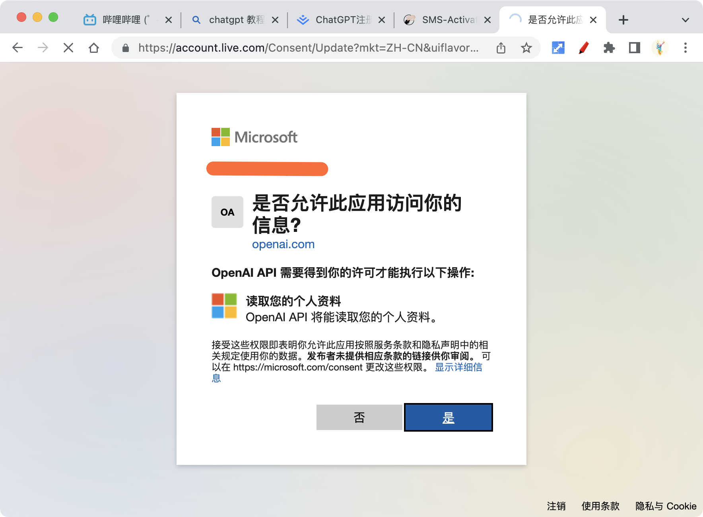

<h1 class="article-title no-number">二、ChatGPT注册</h1>

# 睁眼看世界

要学会让电脑能够「**睁开眼看世界**」。此部分内容不多做介绍，需要的请私信助力！

# 注册账号

打开[https://platform.openai.com/overview](https://platform.openai.com/overview)页面，点击「Sign up」注册按钮。

根据要求，填写信息，并注册一个 ChatGPT 账号。

我是直接使用微软来登录的，跳转到微软的登录页面，输入密码授权登录。

进入微软的授权页面，授权即可。

# 校验邮箱

> 如果你使用微软或谷歌账号授权登录，这一步骤是省略的！

ChatGPT 会给你的邮箱发送验证邮件，打开你注册的邮箱，点击邮件里面的确认按钮即可。

# 购买虚拟手机号

接下来，GhatGPT 需要校验你的手机号，这个号段最好选择美国（+1 开头），因为我试过印度尼西亚的号码，会提示手机号异常，验证码无法发送。

接下来，打开虚拟号码购买平台[https://sms-activate.org/](https://sms-activate.org/)，注册一个账号。

注册成功后，登录系统，并点击头像下面的「充值」按钮，给账户充钱，可以使用支付宝，费率比较低，而且方便。

充 1 美元就已经够买一个号码了，充多了也浪费！

充值成功后，点击左侧的「OpenAI」菜单，这就是专门为 ChatGPT 注册开通的手机号码。

然后选择「**美国（物理）**」这个号码段来购买就可以了，**千万不要选错了国家**，不然就浪费钱了！

购买成功后，就会显示你购买的号码，然后复制你的号码。

# 验证手机号

复制你购买的号码，来到 ChatGPT 的手机号校验页面，这时候，国家要选择和你购买号码段一致，我买的是美国号码，所以这里面要选择美国号码段（+1 开头），然后输入号码后，发送验证码，去「虚拟号码平台」获取这个验证码回来校验就可以啦。

> ⚠️⚠️⚠️**注意！注意！注意！**
>
> 1. 我第一次买的是印度尼西亚号码段，结果提示验证码发送失败，所以为了保险起见，最好不要买亚洲国家号段。
> 2. 手机号段与你的 IP 地址要一致。

# 进入聊天

手机号验证通过后，就可以通过「Playground」进入聊天界面，和 ChatGPT 交流啦。

# 获取 API KEYS

手机号校验通过，就可以获取 API KEYS 使用啦！

