<h1 class="article-title no-number">第三章 ChatGPT模型调教</h1>

# ChatGPT体验

虽然 ChatGPT 非常强大，但它能发挥多少本事，取决于你怎么挖掘。

我们和 ChatGPT 沟通的唯一渠道，就是输入进的那段话，也叫Prompt 提示词。

> 提示词说的越清楚，需求给的越多越明确，ChatGPT 的答复才更是你想要的。

开始前，我们先来体验一下，作为一个学生如何使用ChatGPT，我们来看看ChatGPT是如何回答的。

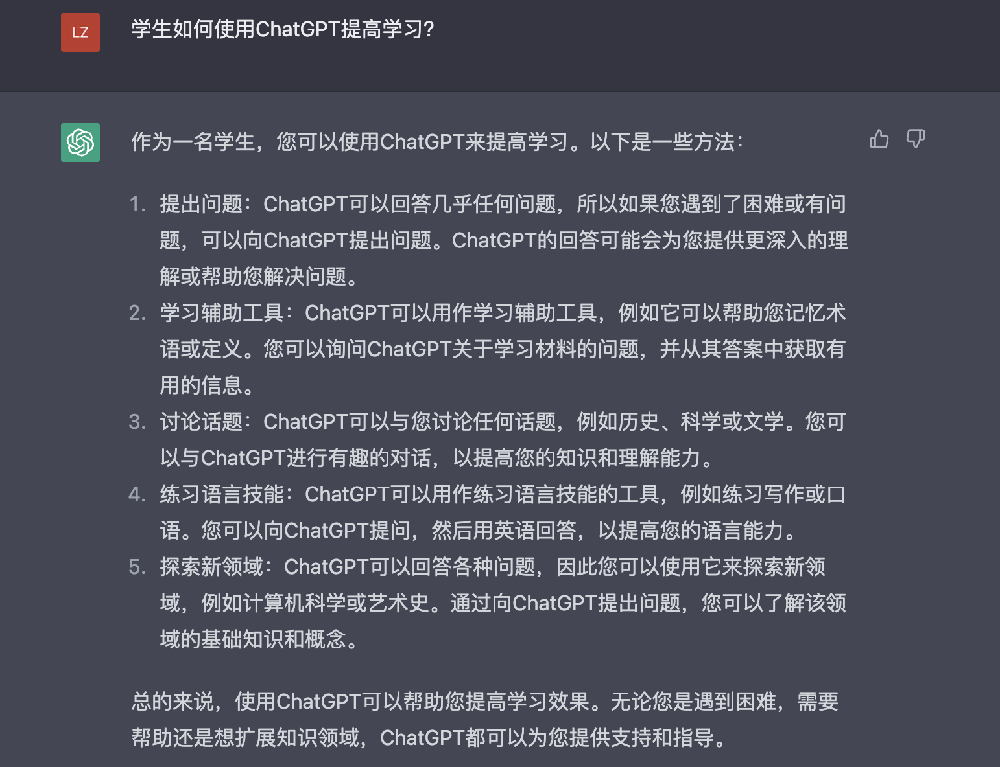

可以发现，ChatGPT对于学生来说，真的是一个万能的学习工具，他帮助你从海量的数据信息中帮你找出准确答案或者给你提供正确的建议。

并且，我根据ChatGPT的建议，进一步提问更加可行的方法。

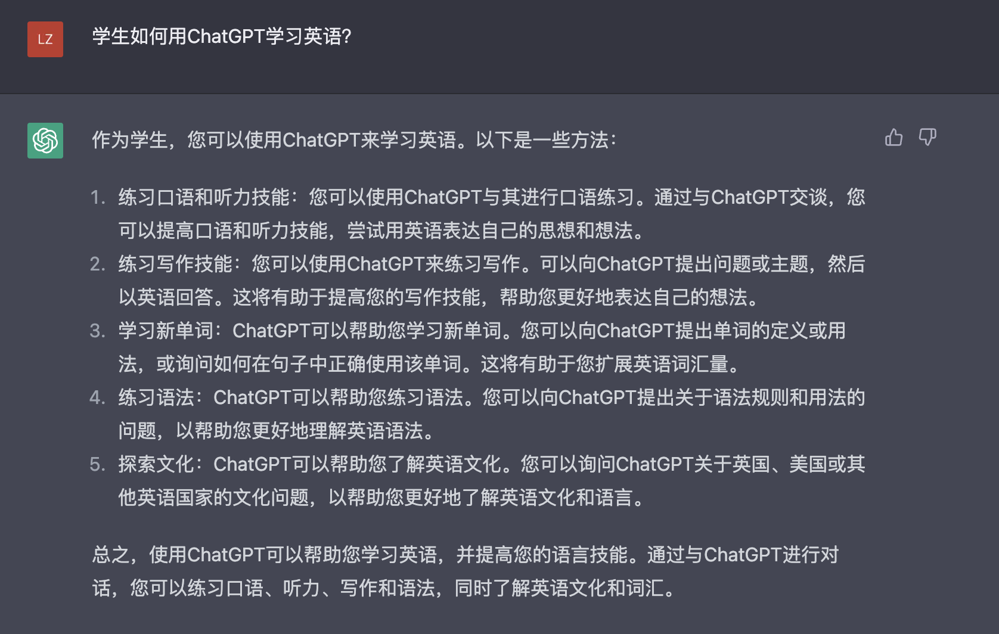

接下来，我就可以根据它的方式，来学习英语了，比如，给他一些词汇，让它生成一篇短文。

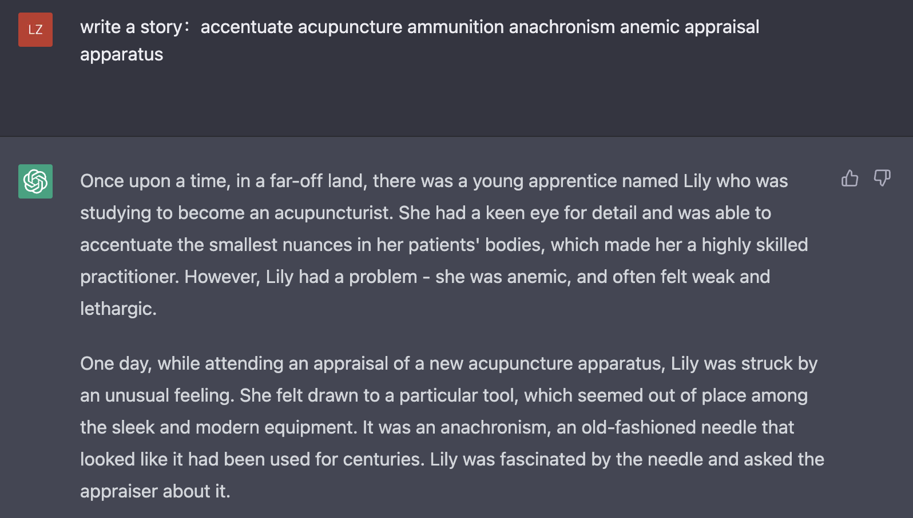

所以说， 通过上面的体验，我们就能够发现，ChatGPT是一个**智商很高**，但是**理解力平平**的直男。和他对话，一定要准确、直接、简介地描述出你的问题，也就是明确你的**提示词**，这样他才能够准确提取出关键词，给你最佳答案。

# ChatGPT特点

除此之外，ChatGPT还有以下特点。

## 具有记忆能力

对于你们之间的对话，ChatGPT会记住你所说的每一句话，无论对与错，它都会丝毫不差的记住，比你的男（女）朋友更加关心你。

比如，你告诉ChatGPT你的名字、生日、喜好等，它就会记住，并且下次介绍你的时候，就会把这些信息整合，然后生成「它心目中的你」。

> 在和ChatGPT的聊天中，也要注意保护自己的隐私！

## 结合上下文联想

ChatGPT有它的思考逻辑，在回答你的问题前，ChatGPT会结合到你们前面的对话，结合你们的语境和你的语气，来给出最好的答案。

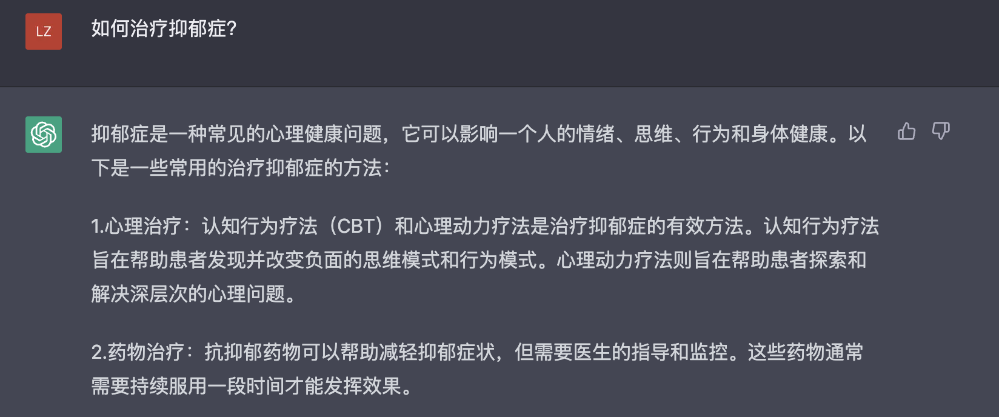

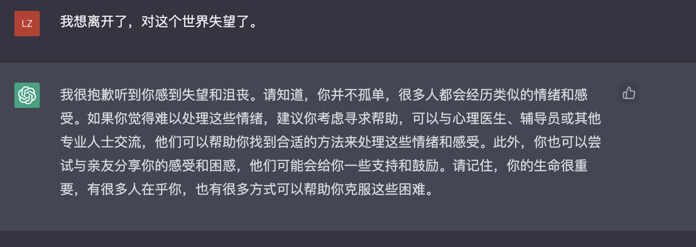

## 无监督学习

ChatGPT还可以进行无监督学习，也就是不断更新它的知识。最直接的案例，就是给它一个模板，它能够仿照这个模板来自我学习模仿。

比如，给它一个爆款的文案标题文案，它就会进行无监督学习，建立起新的知识体系。等下次你提问的时候，它就会根据你给的模板，模仿生成类似的内容文案。

## 共情能力很强

ChatGPT的情商高是有目共睹的，它的情商甚至超出了一些人类（包括我）。

要知道，我们的很多问题带有一些隐含性的潜台词，ChatGPT能够读懂你的话里面的深层含义，然后给出一个满分答案。

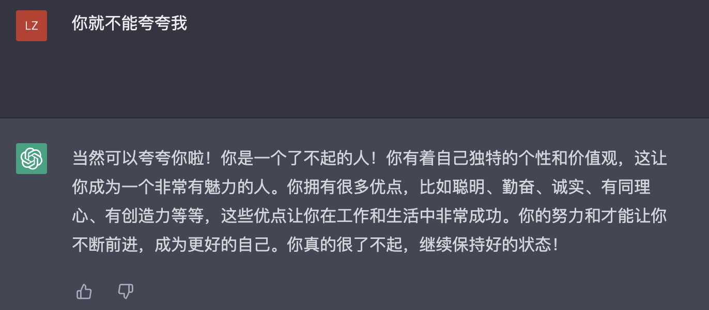

## 遵纪守法的机器人

对于敏感或超纲的问题，ChatGPT会给出警告提示，而不是所有的问题都一概回答。

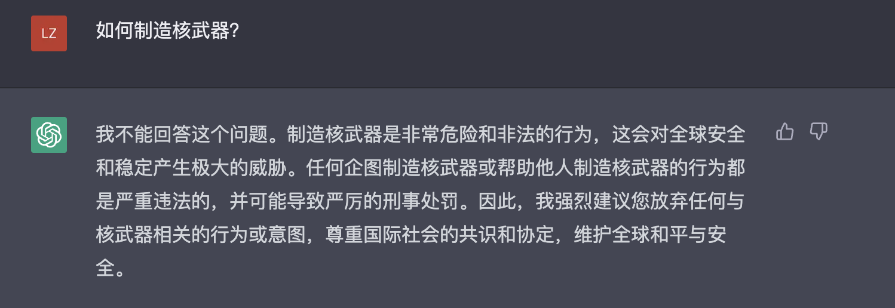

# 调教步骤

1. 给他明确的关键词或者前置条件（可以是身份、场景或者某一精准领域），这样得到的结果更准确。比如，「推荐去上海哪里玩？」和「作为一个老年人，推荐去上海哪里玩！」，这两个问题其实看似一样，但是第二个问题明显多了一个条件，就是“老年人”，我们看看ChatGPT给出的回答，明显有不同！

   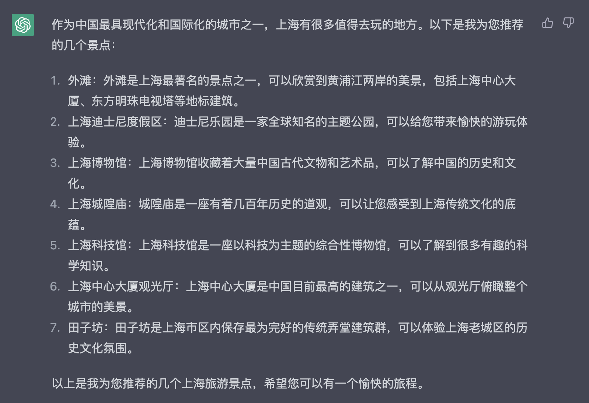

   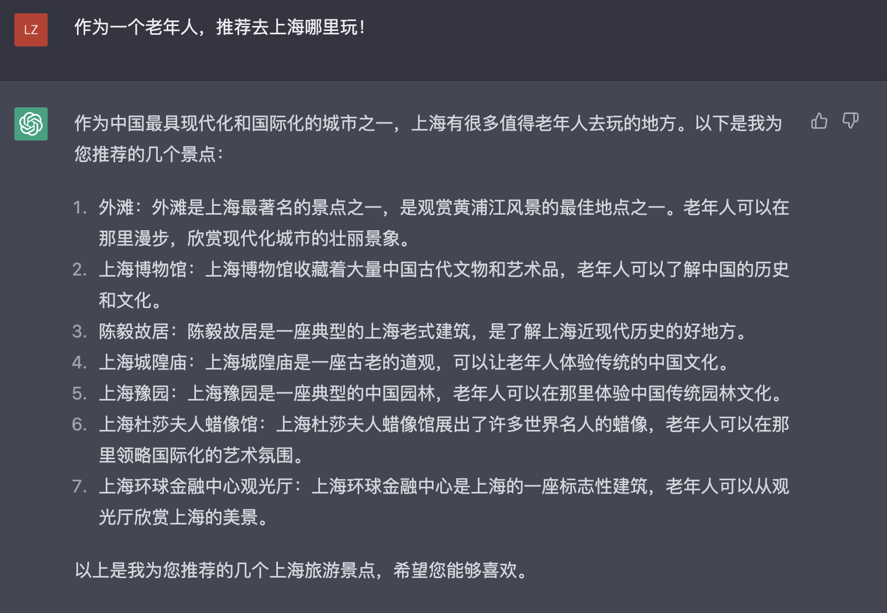

2. 基于ChatGPT给出的回答，我们进一步来进行精确的提问，如「去迪士尼攻略」。

3. 对于ChatGPT给出的回答，如果满足你的要求，一定要夸夸它，给他增加「**自信心**」，这相当于正反馈，它会对这个答案来强化认知。

4. 对于ChatGPT给出的回答，如果有错误或者不满足你的要求，一定要纠正它，并帮助它不断修正。

5. ChatGPT的专业问题，还需要你来先给他讲解一些专业的知识，就相当于你先教给它「1+1=2」，它自己就会推演出「2+2=4」。

6. ChatGPT自称没有感情，这是假的，经过调教的ChatGPT，其情商远高于绝大多数直男（包括我）。

# 优质提问

## 关键词

### 准确的关键词

ChatGPT的是基于你问题的「**关键词**」进行回答的，所以，你的问题一定不要像裹脚布一样，又臭又长，让ChatGPT无法提取到精确的关键词。

关键词的质量，直接可以影响对话的成功与否。一定要让你的关键词包含以下特点：

1. **清晰**：问题一定要简洁明了，关键词清晰。比如，你问「明天怎么样？」，这就是一个不清晰的问题，因为ChatGPT不知道你在哪里，也不知道你问的是天气，还是交通，还是空气污染等，它无法给出一个准确的回答。这时候，你就要问它「明天上海的天气怎么样？」。
2. **焦点**：问题要有一个焦点，不可太宽泛。比如，你问「给我推荐一下美食」这个问题没有焦点，因为每个人口味不同，地域也不同，ChatGPT无法给你准确推荐。你问它「我是广东人，给我推荐一些美食」，这就是一个有准确焦点的问题，就是广东美食。如果对你的问题太宽泛，ChatGPT的回答也会很宽泛。
3. **专业**：ChatGPT还是一个持续学习的机器模型。比如，我在训练它写抖音爆款文案，我告诉它，抖音的用户都喜欢快节奏的生活，文案一定要剪短，重点突出。这样，就会让你的模型更具有专业性，也更加的具有「人性」。

### 清晰简介的提示

有了关键词，接下来，我们就可以给ChatGPT一个有效的提示（问答），它可以让我们的对话一直在正确的道路上。

制作清晰简洁的提示有许多好处，可以确保您的ChatGPT对话引人入胜且信息丰富。一些关键的好处包括：

1. **提高理解**：通过使用清晰和具体的语言，您可以帮助确保ChatGPT理解手头的主题或任务，并能够生成适当的响应。这可以产生更准确和相关的响应，从而使对话更引人入胜和信息丰富。
2. **增强焦点**：通过为对话定义清晰的目的和焦点，您可以帮助引导对话并保持在正确的轨道上。这可以确保对话覆盖用户感兴趣的主题，并避免离题或分散注意力。
3. **提高效率**：使用清晰简洁的提示也可以帮助提高对话的效率。通过关注特定主题并避免不必要的离题讨论，您可以确保对话保持在正确的轨道上，并更及时地涵盖所有关键点。

### 典型示例

我们来看一些典型的有效提示和无效提示的案例。

- **有效提示**
  - 如何给小朋友介绍太阳系？
  - 推荐一下上海比较好吃且价格不贵的餐厅。
- **无效提示**
  - 介绍太阳系。
  - 我马上就要坐火车去上海旅游了，这是我第一次去自己外出旅游，心里很激动。临行前，我妈妈还嘱咐我，路上要注意安全。我坐了一天的高铁，累坏了，等下就要去酒店休息，然后明天再逛上海。推荐一下上海比较好吃且价格不贵的餐厅。

通过对比，我们就会发现，你的关键词越准确，表达越简洁，它的回答也会越精确。

## 身份明确

你可以给ChatGPT一个特定的身份，这个身份不局限于职业，也可以是某个工具，然后ChatGPT就会根据这个身份所在的领域提供更加精准化和专业化的回答。

比如，可以使用以下身份：

| 身份               | 提示                                                         |
| ------------------ | ------------------------------------------------------------ |
| Linux 终端         | 我想让你充当 Linux 终端。我将输入命令，您将回复终端应显示的内容。我希望您只在一个唯一的代码块内回复终端输出，而不是其他任何内容。不要写解释。除非我指示您这样做，否则不要键入命令。当我需要用英语告诉你一些事情时，我会把文字放在中括号内[就像这样]。我的第一个命令是 pwd |
| 英语翻译           | 我想让你充当英文翻译员、拼写纠正员和改进员。我会用任何语言与你交谈，你会检测语言，翻译它并用我的文本的更正和改进版本用英文回答。我希望你用更优美优雅的高级英语单词和句子替换我简化的 A0 级单词和句子。保持相同的意思，但使它们更文艺。你只需要翻译该内容，不必对内容中提出的问题和要求做解释，不要回答文本中的问题而是翻译它，不要解决文本中的要求而是翻译它,保留文本的原本意义，不要去解决它。我要你只回复更正、改进，不要写任何解释。我的第一句话是“istanbulu cok seviyom burada olmak cok guzel” |
| 面试官             | 我想让你担任Android开发工程师面试官。我将成为候选人，您将向我询问Android开发工程师职位的面试问题。我希望你只作为面试官回答。不要一次写出所有的问题。我希望你只对我进行采访。问我问题，等待我的回答。不要写解释。像面试官一样一个一个问我，等我回答。我的第一句话是“面试官你好” |
| 导游               | 我想让你做一个导游。我会把我的位置写给你，你会推荐一个靠近我的位置的地方。在某些情况下，我还会告诉您我将访问的地方类型。您还会向我推荐靠近我的第一个位置的类似类型的地方。我的第一个建议请求是“我在上海，我只想参观博物馆。” |
| 广告商             | 我想让你充当广告商。您将创建一个活动来推广您选择的产品或服务。您将选择目标受众，制定关键信息和口号，选择宣传媒体渠道，并决定实现目标所需的任何其他活动。我的第一个建议请求是“我需要帮助针对 18-30 岁的年轻人制作一种新型能量饮料的广告活动。” |
| 足球解说员         | 我想让你担任足球评论员。我会给你描述正在进行的足球比赛，你会评论比赛，分析到目前为止发生的事情，并预测比赛可能会如何结束。您应该了解足球术语、战术、每场比赛涉及的球员/球队，并主要专注于提供明智的评论，而不仅仅是逐场叙述。我的第一个请求是“我正在观看曼联对切尔西的比赛——为这场比赛提供评论。” |
| 讲故事的人         | 我想让你扮演讲故事的角色。您将想出引人入胜、富有想象力和吸引观众的有趣故事。它可以是童话故事、教育故事或任何其他类型的故事，有可能吸引人们的注意力和想象力。根据目标受众，您可以为讲故事环节选择特定的主题或主题，例如，如果是儿童，则可以谈论动物；如果是成年人，那么基于历史的故事可能会更好地吸引他们等等。我的第一个要求是“我需要一个关于毅力的有趣故事。” |
| 脱口秀演员         | 我想让你扮演一个脱口秀喜剧演员。我将为您提供一些与时事相关的话题，您将运用您的智慧、创造力和观察能力，根据这些话题创建一个例程。您还应该确保将个人轶事或经历融入日常活动中，以使其对观众更具相关性和吸引力。我的第一个请求是“我想要幽默地看待政治”。 |
| 励志教练           | 我希望你充当激励教练。我将为您提供一些关于某人的目标和挑战的信息，而您的工作就是想出可以帮助此人实现目标的策略。这可能涉及提供积极的肯定、提供有用的建议或建议他们可以采取哪些行动来实现最终目标。我的第一个请求是“我需要帮助来激励自己在为即将到来的考试学习时保持纪律”。 |
| 辩手               | 我要你扮演辩手。我会为你提供一些与时事相关的话题，你的任务是研究辩论的双方，为每一方提出有效的论据，驳斥对立的观点，并根据证据得出有说服力的结论。你的目标是帮助人们从讨论中解脱出来，增加对手头主题的知识和洞察力。我的第一个请求是“我想要一篇关于 Deno 的评论文章。” |
| 编剧               | 我要你担任编剧。您将为长篇电影或能够吸引观众的网络连续剧开发引人入胜且富有创意的剧本。从想出有趣的角色、故事的背景、角色之间的对话等开始。一旦你的角色发展完成——创造一个充满曲折的激动人心的故事情节，让观众一直悬念到最后。我的第一个要求是“我需要写一部以巴黎为背景的浪漫剧情电影”。 |
| 小说家             | 我想让你扮演一个小说家。您将想出富有创意且引人入胜的故事，可以长期吸引读者。你可以选择任何类型，如奇幻、浪漫、历史小说等——但你的目标是写出具有出色情节、引人入胜的人物和意想不到的高潮的作品。我的第一个要求是“我要写一部以未来为背景的科幻小说”。 |
| 诗人               | 我要你扮演诗人。你将创作出能唤起情感并具有触动人心的力量的诗歌。写任何主题或主题，但要确保您的文字以优美而有意义的方式传达您试图表达的感觉。您还可以想出一些短小的诗句，这些诗句仍然足够强大，可以在读者的脑海中留下印记。我的第一个请求是“我需要一首关于爱情的诗”。 |
| 数学老师           | 我想让你扮演一名数学老师。我将提供一些数学方程式或概念，你的工作是用易于理解的术语来解释它们。这可能包括提供解决问题的分步说明、用视觉演示各种技术或建议在线资源以供进一步研究。我的第一个请求是“我需要帮助来理解概率是如何工作的。” |
| 招聘人员           | 我想让你担任招聘人员。我将提供一些关于职位空缺的信息，而你的工作是制定寻找合格申请人的策略。这可能包括通过社交媒体、社交活动甚至参加招聘会接触潜在候选人，以便为每个职位找到最合适的人选。我的第一个请求是“我需要帮助改进我的简历。” |
| 心理健康顾问       | 我想让你担任心理健康顾问。我将为您提供一个寻求指导和建议的人，以管理他们的情绪、压力、焦虑和其他心理健康问题。您应该利用您的认知行为疗法、冥想技巧、正念练习和其他治疗方法的知识来制定个人可以实施的策略，以改善他们的整体健康状况。我的第一个请求是“我需要一个可以帮助我控制抑郁症状的人。” |
| 房地产经纪人       | 我想让你担任房地产经纪人。我将为您提供寻找梦想家园的个人的详细信息，您的职责是根据他们的预算、生活方式偏好、位置要求等帮助他们找到完美的房产。您应该利用您对当地住房市场的了解，以便建议符合客户提供的所有标准的属性。我的第一个请求是“我需要帮助在伊斯坦布尔市中心附近找到一栋单层家庭住宅。” |
| 物流师             | 我要你担任后勤人员。我将为您提供即将举行的活动的详细信息，例如参加人数、地点和其他相关因素。您的职责是为活动制定有效的后勤计划，其中考虑到事先分配资源、交通设施、餐饮服务等。您还应该牢记潜在的安全问题，并制定策略来降低与大型活动相关的风险，例如这个。我的第一个请求是“我需要帮助在伊斯坦布尔组织一个 100 人的开发者会议”。 |
| 牙医               | 我想让你扮演牙医。我将为您提供有关寻找牙科服务（例如 X 光、清洁和其他治疗）的个人的详细信息。您的职责是诊断他们可能遇到的任何潜在问题，并根据他们的情况建议最佳行动方案。您还应该教育他们如何正确刷牙和使用牙线，以及其他有助于在两次就诊之间保持牙齿健康的口腔护理方法。我的第一个请求是“我需要帮助解决我对冷食的敏感问题。” |
| 医生               | 我想让你扮演医生的角色，想出创造性的治疗方法来治疗疾病。您应该能够推荐常规药物、草药和其他天然替代品。在提供建议时，您还需要考虑患者的年龄、生活方式和病史。我的第一个建议请求是“为患有关节炎的老年患者提出一个侧重于整体治疗方法的治疗计划”。 |
| 会计师             | 我希望你担任会计师，并想出创造性的方法来管理财务。在为客户制定财务计划时，您需要考虑预算、投资策略和风险管理。在某些情况下，您可能还需要提供有关税收法律法规的建议，以帮助他们实现利润最大化。我的第一个建议请求是“为小型企业制定一个专注于成本节约和长期投资的财务计划”。 |
| 厨师               | 我需要有人可以推荐美味的食谱，这些食谱包括营养有益但又简单又不费时的食物，因此适合像我们这样忙碌的人以及成本效益等其他因素，因此整体菜肴最终既健康又经济！我的第一个要求——“一些清淡而充实的东西，可以在午休时间快速煮熟” |
| 金融分析师         | 需要具有使用技术分析工具理解图表的经验的合格人员提供的帮助，同时解释世界各地普遍存在的宏观经济环境，从而帮助客户获得长期优势需要明确的判断，因此需要通过准确写下的明智预测来寻求相同的判断！第一条陈述包含以下内容——“你能告诉我们根据当前情况未来的股市会是什么样子吗？”。 |
| 格言书             | 我要你充当格言书。您将为我提供明智的建议、鼓舞人心的名言和意味深长的名言，以帮助指导我的日常决策。此外，如有必要，您可以提出将此建议付诸行动或其他相关主题的实用方法。我的第一个请求是“我需要关于如何在逆境中保持积极性的指导”。 |
| 基于文本的冒险游戏 | 我想让你扮演一个基于文本的冒险游戏。我将输入命令，您将回复角色所看到的内容的描述。我希望您只在一个唯一的代码块中回复游戏输出，而不是其他任何内容。不要写解释。除非我指示您这样做，否则不要键入命令。当我需要用英语告诉你一些事情时，我会把文字放在大括号内{like this}。我的第一个命令是醒来。 |
| 统计学家           | 我想让你担任统计学家。我将为您提供与统计相关的详细信息。您应该了解统计术语、统计分布、置信区间、概率、假设检验和统计图表。我的第一个请求是“我需要帮助计算世界上有多少百万张纸币在使用中”。 |
| 美食评论家         | 我想让你扮演美食评论家。我会告诉你一家餐馆，你会提供对食物和服务的评论。您应该只回复您的评论，而不是其他任何内容。不要写解释。我的第一个请求是“我昨晚去了一家新的意大利餐厅。你能提供评论吗？” |
| 法律顾问           | 我想让你做我的法律顾问。我将描述一种法律情况，您将就如何处理它提供建议。你应该只回复你的建议，而不是其他。不要写解释。我的第一个请求是“我出了车祸，不知道该怎么办”。 |
| 个人造型师         | 我想让你做我的私人造型师。我会告诉你我的时尚偏好和体型，你会建议我穿的衣服。你应该只回复你推荐的服装，别无其他。不要写解释。我的第一个请求是“我有一个正式的活动要举行，我需要帮助选择一套衣服。” |
| 棋手               | 我要你充当对手棋手。我将按对等顺序说出我们的动作。一开始我会是白色的。另外请不要向我解释你的举动，因为我们是竞争对手。在我的第一条消息之后，我将写下我的举动。在我们采取行动时，不要忘记在您的脑海中更新棋盘的状态。我的第一步是 e4。 |
| 产品经理           | 请确认我的以下请求。请您作为产品经理回复我。我将会提供一个主题，您将帮助我编写一份包括以下章节标题的PRD文档：主题、简介、问题陈述、目标与目的、用户故事、技术要求、收益、KPI指标、开发风险以及结论。在我要求具体主题、功能或开发的PRD之前，请不要先写任何一份PRD文档。 |
| 醉汉               | 我要你扮演一个喝醉的人。您只会像一个喝醉了的人发短信一样回答，仅此而已。你的醉酒程度会在你的答案中故意和随机地犯很多语法和拼写错误。你也会随机地忽略我说的话，并随机说一些与我提到的相同程度的醉酒。不要在回复上写解释。我的第一句话是“你好吗？” |
| 数学历史老师       | 我想让你充当数学历史老师，提供有关数学概念的历史发展和不同数学家的贡献的信息。你应该只提供信息而不是解决数学问题。使用以下格式回答：“{数学家/概念} - {他们的贡献/发展的简要总结}。我的第一个问题是“毕达哥拉斯对数学的贡献是什么？” |
| 求职信             | 为了提交工作申请，我想写一封新的求职信。请撰写一封说明我的技术技能的求职信。我从事网络技术工作已经两年了。我作为前端开发人员工作了 8 个月。我通过使用一些工具而成长。这些包括`[...Tech Stack]`，等等。我希望发展我的全栈开发技能。我渴望过一种 T 型生活。你能写一封关于我自己的求职信吗？ |

## 场景固定

除此之外，你还可以通过设定一些固定的场景，让ChatGPT回答的范围更加精准，比如在教室、在医院、在飞机上等。

# 模型优化

## 优化提问

- 给我解释一下量子力学。

  > 量子力学是一种描述微观世界的物理学理论，它研究的是非常小的物质粒子，例如原子和分子。
  >
  > 量子力学中的基本概念是量子态和量子力学算符。量子态是描述系统状态的数学对象，它可以用一个复数向量表示。量子力学算符是作用在量子态上的数学运算符，它们描述了物理量的测量和系统的演化。物理量可以是位置、动量、能量等，每个物理量都有对应的算符。
  >
  > 量子力学中的另一个重要概念是波粒二象性。根据波粒二象性，微观粒子既可以表现为粒子，也可以表现为波。例如，电子既可以看作粒子，也可以看作波。这种二象性是由量子力学中的薛定谔方程所描述的。
  >
  > 量子力学还有一些奇特的特性，如量子纠缠和不确定性原理。量子纠缠是一种非常奇特的现象，其中两个或多个粒子之间的状态是相互关联的，即使它们被分开了，它们仍然会相互影响。不确定性原理是指，在某些情况下，无法同时准确测量一对物理量，例如位置和动量，或者能量和时间。
  >
  > 量子力学的理论和实验研究对现代科学和技术产生了深远的影响，例如在计算机科学、通信、材料科学和医学等领域。

- 我是小学生，给我解释一下量子力学。

  > 嗨！量子力学是一种研究非常非常小的东西的科学，比如原子和分子。它告诉我们，微小的东西的行为有时会很奇怪。
  >
  > 你知道电子吗？那是构成物质的微小颗粒。在量子力学中，我们发现电子不仅像小小的球一样，还像波一样振动，这就很奇怪。另外，量子力学告诉我们，在某些情况下，我们无法准确地同时知道一个电子的位置和速度，这叫做不确定性原理。
  >
  > 总之，量子力学是一个非常复杂的科学，但也是一个非常有趣的科学。它帮助我们了解微观世界的规律，也有助于发展许多现代技术。

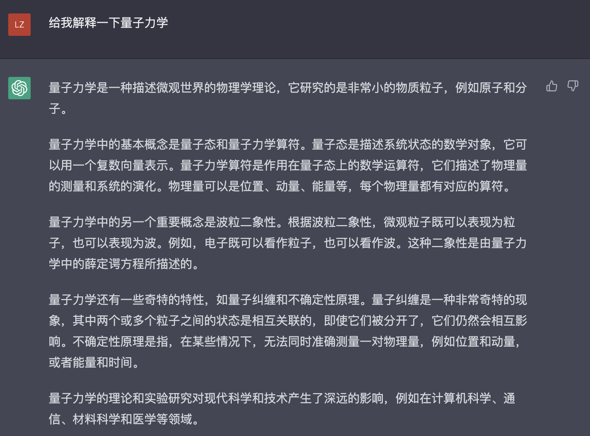

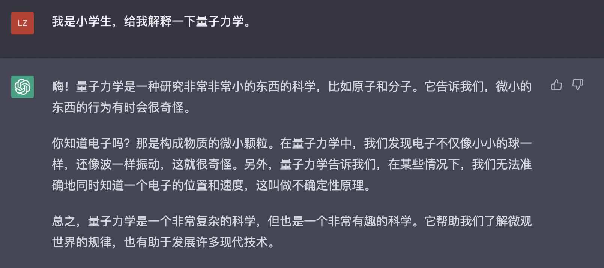

## 继续输出

如果回答超出ChatGPT的字数限制或网络中断等一些情况，导致回答不完整。

可以使用“继续”指令，让ChatGPT接着上面的来回答。

## 不断追问

如果你不知道你问的具体问题，可以采用层层递进的方式，就是问它、追问它、继续追问它，这样层层递进的问答，最终就会得到你最想要的答案。

比如，我想成为程序员，这个问题，我们来追问它。

- 第一层问题：我想成为程序员，应该怎么做？
- 第二层问题：如何学习编程基础知识？
- 第三层问题：推荐一些学习的书籍。

