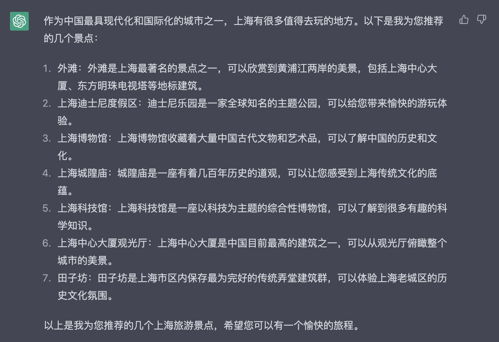
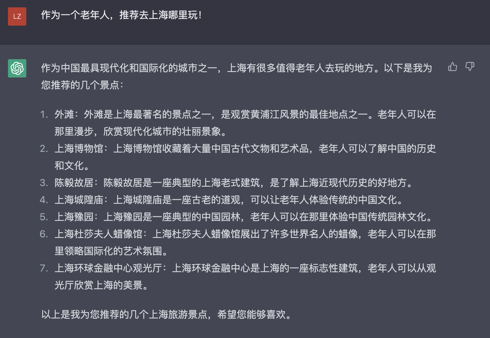

<h1 class="article-title no-number">ChatGPT模型调教</h1>

# ChatGPT体验

虽然 ChatGPT 非常强大，但它能发挥多少本事，取决于你怎么挖掘。

我们和 ChatGPT 沟通的唯一渠道，就是输入进的那段话，也叫Prompt 提示词。

> 提示词说的越清楚，需求给的越多越明确，ChatGPT 的答复才更是你想要的。

开始前，我们先来体验一下，作为一个学生如何使用ChatGPT，我们来看看ChatGPT是如何回答的。

可以发现，ChatGPT对于学生来说，真的是一个万能的学习工具，他帮助你从海量的数据信息中帮你找出准确答案或者给你提供正确的建议。

并且，我根据ChatGPT的建议，进一步提问更加可行的方法。

接下来，我就可以根据它的方式，来学习英语了，比如，给他一些词汇，让它生成一篇短文。

所以说， 通过上面的体验，我们就能够发现，ChatGPT是一个**智商很高**，但是**理解力平平**的直男。和他对话，一定要准确、直接、简介地描述出你的问题，也就是明确你的**提示词**，这样他才能够准确提取出关键词，给你最佳答案。

# ChatGPT特点

除此之外，ChatGPT还有以下特点。

## 具有记忆能力

对于你们之间的对话，ChatGPT会记住你所说的每一句话，无论对与错，它都会丝毫不差的记住，比你的男（女）朋友更加关心你。

比如，你告诉ChatGPT你的名字、生日、喜好等，它就会记住，并且下次介绍你的时候，就会把这些信息整合，然后生成「它心目中的你」。

> 在和ChatGPT的聊天中，也要注意保护自己的隐私！

## 结合上下文联想

ChatGPT有它的思考逻辑，在回答你的问题前，ChatGPT会结合到你们前面的对话，结合你们的语境和你的语气，来给出最好的答案。

## 无监督学习

ChatGPT还可以进行无监督学习，也就是不断更新它的知识。最直接的案例，就是给它一个模板，它能够仿照这个模板来自我学习模仿。

比如，给它一个爆款的文案标题文案，它就会进行无监督学习，建立起新的知识体系。等下次你提问的时候，它就会根据你给的模板，模仿生成类似的内容文案。

## 共情能力很强

ChatGPT的情商高是有目共睹的，它的情商甚至超出了一些人类（包括我）。

要知道，我们的很多问题带有一些隐含性的潜台词，ChatGPT能够读懂你的话里面的深层含义，然后给出一个满分答案。

## 遵纪守法的机器人

对于敏感或超纲的问题，ChatGPT会给出警告提示，而不是所有的问题都一概回答。

# 调教步骤

1. 给他明确的关键词或者前置条件（可以是身份、场景或者某一精准领域），这样得到的结果更准确。比如，「推荐去上海哪里玩？」和「作为一个老年人，推荐去上海哪里玩！」，这两个问题其实看似一样，但是第二个问题明显多了一个条件，就是“老年人”，我们看看ChatGPT给出的回答，明显有不同！

   

   

2. 基于ChatGPT给出的回答，我们进一步来进行精确的提问，如「去迪士尼攻略」。

3. 对于ChatGPT给出的回答，如果满足你的要求，一定要夸夸它，给他增加「**自信心**」，这相当于正反馈，它会对这个答案来强化认知。

4. 对于ChatGPT给出的回答，如果有错误或者不满足你的要求，一定要纠正它，并帮助它不断修正。

5. ChatGPT的专业问题，还需要你来先给他讲解一些专业的知识，就相当于你先教给它「1+1=2」，它自己就会推演出「2+2=4」。

6. ChatGPT自称没有感情，这是假的，经过调教的ChatGPT，其情商远高于绝大多数直男（包括我）。

# 优质提问

## 关键词

### 准确的关键词

ChatGPT的是基于你问题的「**关键词**」进行回答的，所以，你的问题一定不要像裹脚布一样，又臭又长，让ChatGPT无法提取到精确的关键词。

关键词的质量，直接可以影响对话的成功与否。一定要让你的关键词包含以下特点：

1. **清晰**：问题一定要简洁明了，关键词清晰。比如，你问「明天怎么样？」，这就是一个不清晰的问题，因为ChatGPT不知道你在哪里，也不知道你问的是天气，还是交通，还是空气污染等，它无法给出一个准确的回答。这时候，你就要问它「明天上海的天气怎么样？」。
2. **焦点**：问题要有一个焦点，不可太宽泛。比如，你问「给我推荐一下美食」这个问题没有焦点，因为每个人口味不同，地域也不同，ChatGPT无法给你准确推荐。你问它「我是广东人，给我推荐一些美食」，这就是一个有准确焦点的问题，就是广东美食。如果对你的问题太宽泛，ChatGPT的回答也会很宽泛。
3. **专业**：ChatGPT还是一个持续学习的机器模型。比如，我在训练它写抖音爆款文案，我告诉它，抖音的用户都喜欢快节奏的生活，文案一定要剪短，重点突出。这样，就会让你的模型更具有专业性，也更加的具有「人性」。

### 清晰简介的提示

有了关键词，接下来，我们就可以给ChatGPT一个有效的提示（问答），它可以让我们的对话一直在正确的道路上。

制作清晰简洁的提示有许多好处，可以确保您的ChatGPT对话引人入胜且信息丰富。一些关键的好处包括：

1. **提高理解**：通过使用清晰和具体的语言，您可以帮助确保ChatGPT理解手头的主题或任务，并能够生成适当的响应。这可以产生更准确和相关的响应，从而使对话更引人入胜和信息丰富。
2. **增强焦点**：通过为对话定义清晰的目的和焦点，您可以帮助引导对话并保持在正确的轨道上。这可以确保对话覆盖用户感兴趣的主题，并避免离题或分散注意力。
3. **提高效率**：使用清晰简洁的提示也可以帮助提高对话的效率。通过关注特定主题并避免不必要的离题讨论，您可以确保对话保持在正确的轨道上，并更及时地涵盖所有关键点。

### 典型示例

我们来看一些典型的有效提示和吴小提示的案例。

- 有效提示
  - 如何给小朋友介绍太阳系？
  - 推荐一下上海比较好吃且价格不贵的餐厅。
- 无效提示
  - 介绍太阳系。
  - 我马上就要坐火车去上海旅游了，这是我第一次去自己外出旅游，心里很激动。临行前，我妈妈还嘱咐我，路上要注意安全。我坐了一天的高铁，累坏了，等下就要去酒店休息，然后明天再逛上海。推荐一下上海比较好吃且价格不贵的餐厅。

通过对比，我们就会发现，你的关键词越准确，表达越简洁，它的回答也会越精确。

## 身份明确？？？

https://zhuanlan.zhihu.com/p/609869105

## 场景固定

# 模型优化

## 优化提问

- 给我解释一下量子力学。

  > 量子力学是一种描述微观世界的物理学理论，它研究的是非常小的物质粒子，例如原子和分子。
  >
  > 量子力学中的基本概念是量子态和量子力学算符。量子态是描述系统状态的数学对象，它可以用一个复数向量表示。量子力学算符是作用在量子态上的数学运算符，它们描述了物理量的测量和系统的演化。物理量可以是位置、动量、能量等，每个物理量都有对应的算符。
  >
  > 量子力学中的另一个重要概念是波粒二象性。根据波粒二象性，微观粒子既可以表现为粒子，也可以表现为波。例如，电子既可以看作粒子，也可以看作波。这种二象性是由量子力学中的薛定谔方程所描述的。
  >
  > 量子力学还有一些奇特的特性，如量子纠缠和不确定性原理。量子纠缠是一种非常奇特的现象，其中两个或多个粒子之间的状态是相互关联的，即使它们被分开了，它们仍然会相互影响。不确定性原理是指，在某些情况下，无法同时准确测量一对物理量，例如位置和动量，或者能量和时间。
  >
  > 量子力学的理论和实验研究对现代科学和技术产生了深远的影响，例如在计算机科学、通信、材料科学和医学等领域。

- 我是小学生，给我解释一下量子力学。

  > 嗨！量子力学是一种研究非常非常小的东西的科学，比如原子和分子。它告诉我们，微小的东西的行为有时会很奇怪。
  >
  > 你知道电子吗？那是构成物质的微小颗粒。在量子力学中，我们发现电子不仅像小小的球一样，还像波一样振动，这就很奇怪。另外，量子力学告诉我们，在某些情况下，我们无法准确地同时知道一个电子的位置和速度，这叫做不确定性原理。
  >
  > 总之，量子力学是一个非常复杂的科学，但也是一个非常有趣的科学。它帮助我们了解微观世界的规律，也有助于发展许多现代技术。

## 继续输出

如果回答超出ChatGPT的字数限制或网络中断等一些情况，导致回答不完整。

可以使用“继续”指令，让ChatGPT接着上面的来回答。

## 不断追问

如果你不知道你问的具体问题，可以采用层层递进的方式，就是问它、追问它、继续追问它，这样层层递进的问答，最终就会得到你最想要的答案。

比如，我想成为程序员，这个问题，我们来追问它。

- 第一层问题：我想成为程序员，应该怎么做？
- 第二层问题：如何学习编程基础知识？
- 第三层问题：推荐一些学习的书籍。

