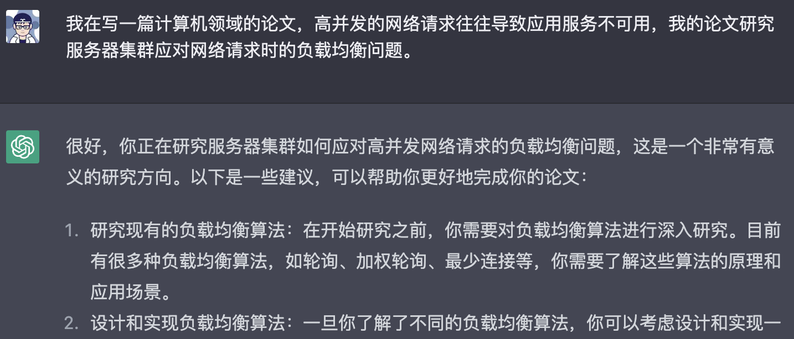
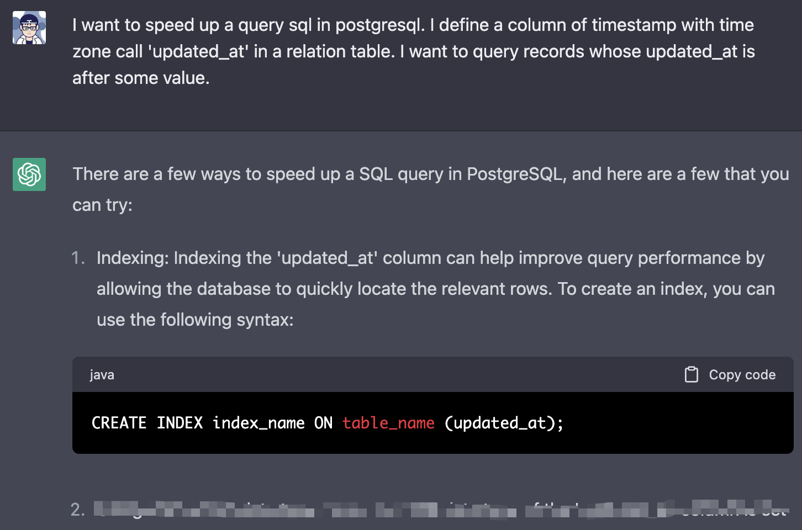
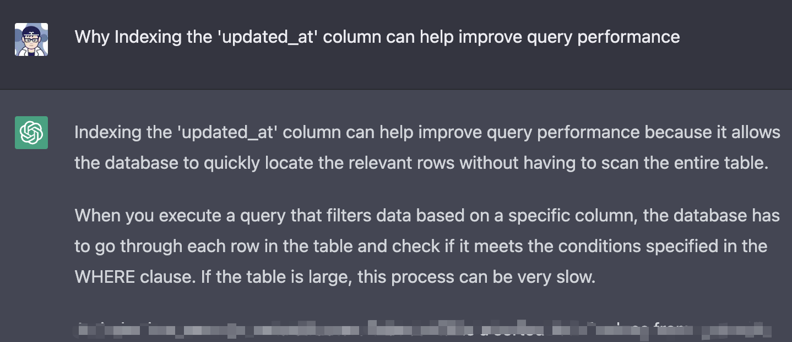
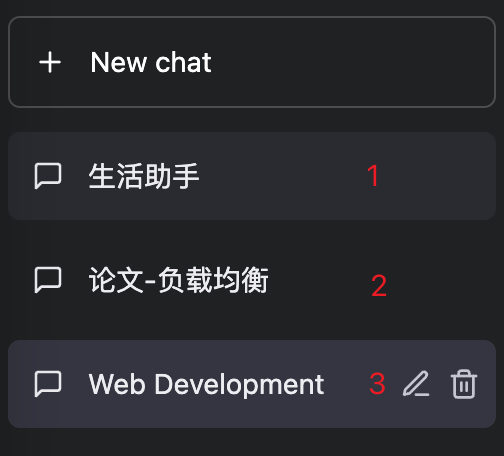

<h1 class="article-title no-number">第四章 ChatGPT实战应用</h1>

ChatGPT 实际应用的**金科玉律**：

- 前戏很重要
- 日久生情

# 金科玉律（一）：前戏很重要

> 这个前戏，不是那个前戏。

ChatGPT 擅长文本和逻辑处理，联系上下文的话可以给出更合乎逻辑的答复。所以，铺垫好语境 ChatGPT 能提供更好的帮助。

简单介绍几个使用场景：
- 论文润色
- 编程技术释义
- 给 App 写一个 slogon

## 论文润色

前戏：给你的助手（ChatGPT）介绍论文的领域、背景、研究的问题，让它有大致的了解：

> 我在写一篇计算机领域的论文，高并发的网络请求往往导致应用服务不可用，我的论文研究服务器集群应对网络请求时的负载均衡问题。

它看起来真的很懂，回答的是通用的负载均衡算法，这代表它会意了你的研究范围。

接下来开工，让它帮忙润色论文的前言部分：

尤其论文初稿阶段，用词和逻辑未必通顺，经过 ChatGPT 的一番润色，读起来蛮顺畅的。

## 编程技术释义

前戏：Web Development

> 即便前戏如此简短，ChatGPT 也会坦诚相待。

接下来让它帮我解答一个工作中遇到的 PgSQL 索引问题。使用英文描述的问题，对它更友好（忽略这土味儿英语）：

它给出了几条优化建议，问题描述的越详细，它给的回答也越能解答你的疑惑。

我不太放心它给的答案，就追问优化措施的原理：

它则阐述了时间戳（timestamp）类型在 PgSQL 中的存储结构，已经索引优化查询的原理。我用 Google 搜索同样这个问题，关键字换了好几个，才找到比较满意的答案。

当然，这类简单的技术问题，它回答的算是准确、快速，但对于工程设计方面很难回答到点上。比如，使用 Gradle 搭建一个基础依赖库的项目（脚手架 build.gradle），无论怎么调戏 ChatGPT 都给不出一个靠谱的配置方案。最终还是借助经验和 Google 完成了这项工作。

## 给 App 写一个 slogon

前戏：介绍下这个 App 的设计意图

> 我正在开发一个生活助手 App 用来记录生活时间、阅读时间、财务流水，并且希望通过它连接好友，促进大家共同进步。

接下来，需要设计一个响亮的 Slogon 用来标识和宣传这个 App：

给的这些短句基本都在点子上，只需要挑选和组合下基本能拿来用。这些短句、单词还能用作 Prompt借助 [Stable Diffusion](https://stablediffusionweb.com/) 生成 logo 或者图片。

# 金科玉律（二）：日久生情

左侧可以建立多个会话，切勿“聊骚”完就删掉。

每个会话中保存着那些聊过的天、调过的“情”，下次再聊起的时候，ChatGPT 可以根据前文来提供帮助。
比如：

- 「论文」会话：它知晓论文的领域、研究的主题，倘若让它帮忙推荐算法、参考文献，它给的答复无疑比新会话更准确。
- 「生活助手」会话：在 App 开发的整个项目周期中，都可以在这个会话中寻求帮助，它更了解你的设计意图、技术体系。
