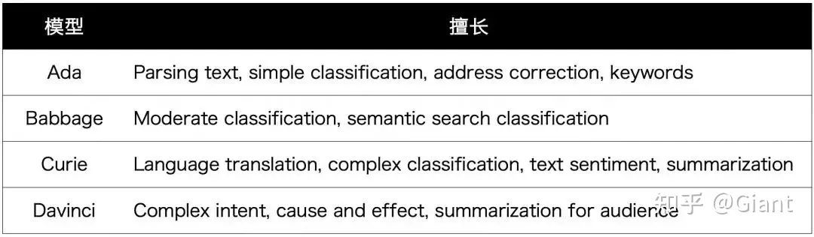
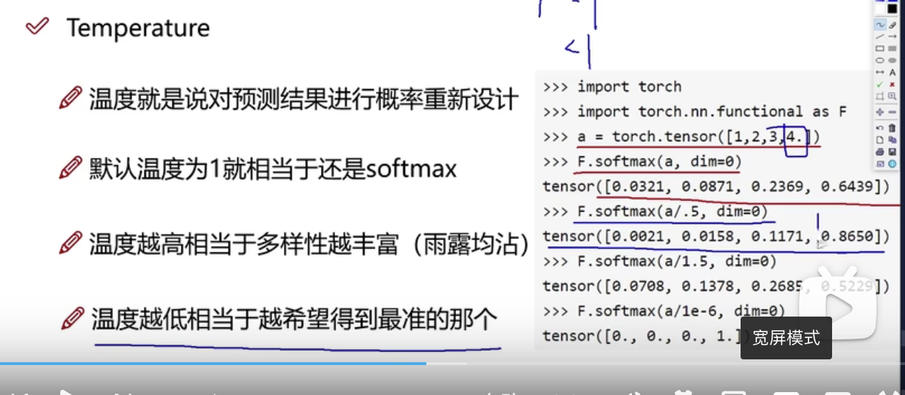
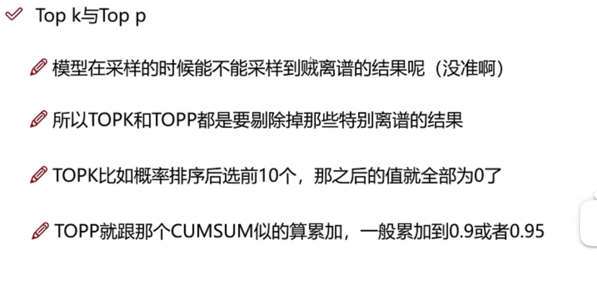

<h1 class="article-title no-number">第五章 ChatGPT接口开发</h1>

[官方文档：https://platform.openai.com/docs](https://platform.openai.com/docs)

[官方示例：https://platform.openai.com/examples](https://platform.openai.com/examples)


价格方面，GPT-3一共提供了4款模型供用户选择，Ada是最轻量、响应最快的模型，Davinci效果最强大，可以应对复杂文本推理和因果分析。

每位用户在开始的3个月中，有18刀的免费额度。后面只需要为你使用的资源付费。




如果你想在某些子领域内获得更好的性能，还可以通过特定数据微调GPT-3，同样也是按token收费。


## **Model as a Service**

**GPT-3是第一个将模型转换为付费服务的PLM产品**，从这个角度看具有划时代的意义。

**它真正厉害的地方在于few-shot能力，在不精调或者只利用prompt的情况下就能获得很好的效果，从而实现卖服务长期捞金的商业模式。**

此前GPT-3已经提供了最基础的生成、分类、问答、搜索应用的API，还能满足用户多种**定制化需求**。例如分类支持用户提供标注示例，搜素支持用户上传自定义文档等等。

这些贴心的设计只为向用户传递一个信息：GPT-3不是一个停留在实验室的demo，而是真的能产生实际价值！

国内目前对于巨无霸模型的玩法，基本是先在某一个评测数据集上刷到sota，然后火速转成一篇paper证明这种方法work，最后“忍痛”把权重开源。对于模型在实际业务中的落地，考虑的有点少。








# 网页调用

直接打开 ChatGPT 的 Playground 页面，就可以和 ChatGPT 进行交流啦。


# 代码调用

在 Playground 的右侧，又「View Code」按钮，点击即可生成代码，通过接口调用的方式来实现和 ChatGPT 的交流。


# 常用接口

## 模型列表接口

### 请求地址

`GET https://api.openai.com/v1/models`

### 响应示例

```json
{
  "object": "list",
  "data": [
    {
      "id": "text-davinci-003",
      "object": "model",
      "created": 1669599635,
      "owned_by": "openai-internal",
      "permission": [
        {
          "id": "modelperm-uMf6VYZzCViLNDAJNdPIL0pI",
          "object": "model_permission",
          "created": 1676599391,
          "allow_create_engine": false,
          "allow_sampling": true,
          "allow_logprobs": true,
          "allow_search_indices": false,
          "allow_view": true,
          "allow_fine_tuning": false,
          "organization": "*",
          "group": null,
          "is_blocking": false
        }
      ],
      "root": "text-davinci-003",
      "parent": null
    }
  ]
}
```

## Completion 接口

### 请求地址

https://api.openai.com/v1/completions

### 请求参数

| 请求参数          | 说明                                                                                                                                    |
| ----------------- | --------------------------------------------------------------------------------------------------------------------------------------- |
| model             | 必填，可以通过模型列表获取。<br />一般使用”text-davinci-003“即可                                                                        |
| prompt            | 生成结果的提示文本，即你想要得到的内容描述。                                                                                            |
| suffix            | 后缀                                                                                                                                    |
| max_tokens        | 最大字数                                                                                                                                |
| temperature       | 控制结果的随机性，在[0,2]之间取值。如果希望结果更有创意可以尝试 0.9，或者希望有固定结果可以尝试 0                                       |
| top_p             | 一个可用于代替 `temperature` 的参数，对应机器学习中 **nucleus sampling**，如果设置 _0.1_ 意味着只考虑构成前 _10%_ 概率质量的 **tokens** |
| frequency_penalty | 控制字符的重复度，在 [-2.0, 2.0] 之间的数字，正值会根据新 **tokens** 在文本中的现有频率对其进行惩罚，从而降低模型逐字重复同一行的可能性 |
| presence_penalty  | 控制主题的重复度，在[-2.0, 2.0]之间的数字，正值会根据到目前为止是否出现在文本中来惩罚新 **tokens**，从而增加模型谈论新主题的可能性      |
| stop              | 最大长度为 _4_ 的字符串列表，一旦生成的 **tokens** 包含其中的内容，将停止生成并返回结果                                                 |

### 使用示例


