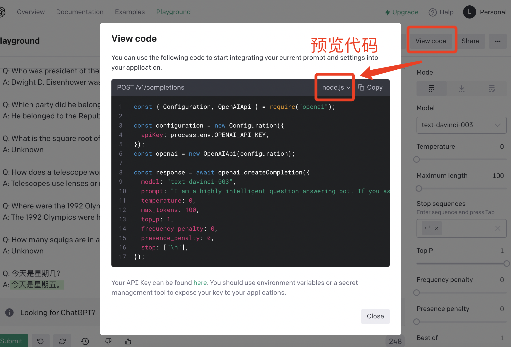

<h1 class="article-title no-number">第五章 ChatGPT接口开发</h1>

[官方文档：https://platform.openai.com/docs](https://platform.openai.com/docs)

[官方示例：https://platform.openai.com/examples](https://platform.openai.com/examples)

# 模型介绍

GPT-3一共提供了4款模型供用户选择，Ada是最轻量、响应最快的模型，Davinci效果最强大，可以应对复杂文本推理和因果分析。

## 模型列表

| 模型    | 参数量 | 描述                                                         | 擅长                                                         |
| ------- | ------ | ------------------------------------------------------------ | ------------------------------------------------------------ |
| Ada     | 350M   | Ada通常是**最快的模型**，可支持解析文本、地址更正，性能根据提供更多上下文来提高。 | Parsing text/解析文本<br />Simple classification/简单分类<br />Address correction/地址更正<br />Keywords/关键词 |
| Babbage | 1.3B   | 可以执行简单的任务，例如简单的分类。 在语义搜索方面，它也非常有能力对文档与搜索查询的匹配程度进行排名。 | Moderate classification/简单分类<br />Semantic search /语义搜索 |
| Curie   | 6.7B   | Curie功能强大且速度快。虽然 Davinci 在分析复杂文本方面更强大，但 Curie 能够胜任许多细微的任务，例如情感分类和摘要。 Curie 还非常擅长回答问题和执行问答以及作为通用服务聊天机器人。 | Language translation/语言翻译<br /> Complex classification/复杂分类<br />Text sentiment/文本情感<br />Summarization/总结 |
| Davinci | 175B   | Davinci 是最有能力的模型系列，可以执行其他模型可以执行的任何任务，而且通常只需要很少的指令。 对于需要对内容有大量理解的应用程序，例如针对特定受众的摘要和创意内容生成，Davinci 将产生最佳结果。<br />这些增加的功能需要更多的计算资源，因此 Davinci 每次 API 调用的成本更高，并且不如其他模型快。 Davinci 的另一个亮点是理解文本的意图。Davinci擅长解决多种逻辑问题和解释人物的动机。 Davinci已经能够解决一些涉及因果关系的最具挑战性的人工智能问题。 | Complex intent/复杂意图<br />Cause and effect/因果关系<br /> Summarization/总结 |

## GPT-3.5模型

GPT-3.5模型可以理解并生成自然语言或代码。我们最强大且最具成本效益的模型是`gtp-3.5-turbo`，针对聊天进行了优化，但也适用于完成传统任务。

| 最新                 | 描述                                                         | 最大请求    | 训练数据      |
| -------------------- | ------------------------------------------------------------ | ----------- | ------------- |
| `gtp-3.5-turbo`      | 功能最强大的GPT-3.5模型，并针对聊天进行了优化，成本仅为`text-davinci-003`的十分之一，将使用我们最新的模型迭代进行更新。 | 4096 tokens | 截止2021年9月 |
| `gtp-3.5-turbo-0301` | 2023 年 3 月 1 日的快照`gpt-3.5-turbo`。与`gpt-3.5-turbo`不同的是，此模型不会收到更新，并且只会在 2023 年 6 月 1 日终止服务。 | 4096 tokens | 截止2021年9月 |
| `text-davinci-003`   | 可以以`Curie`、`Babbage`或 `Ada`模型更好的质量、更长的输出和一致的指令遵循来完成任何语言任务，还支持在文本中插入补全。 | 4096 tokens | 截止2021年6月 |
| `text-davinci-002`   | 类似的能力，`text-davinci-003`但训练有监督的微调而不是强化学习 | 4000 tokens | 截止2021年6月 |
| `code-davinci-001`   | 优化代码完成任务。                                           | 4000 tokens | 截止2021年6月 |

我们建议`gpt-3.5-turbo`在试验时使用，因为它会产生最佳结果。一旦一切正常，我们鼓励您尝试其他模型，看看是否能以更低的延迟或成本获得相同的结果。

> OpenAI 模型是不确定的，这意味着相同的输入可以产生不同的输出。将`temperature`设置为 0 将使输出大部分具有确定性，但可能会保留少量可变性。

# 网页调用

直接打开 ChatGPT 的 Playground 页面，就可以和 ChatGPT 进行交流啦。


# 代码调用

在 Playground 的右侧，又「View Code」按钮，点击即可生成代码，通过接口调用的方式来实现和 ChatGPT 的交流。



# 常用接口

## 模型列表接口

### 请求地址

`GET https://api.openai.com/v1/models`

### 响应示例

```json
{
  "object": "list",
  "data": [
    {
      "id": "text-davinci-003",
      "object": "model",
      "created": 1669599635,
      "owned_by": "openai-internal",
      "permission": [
        {
          "id": "modelperm-uMf6VYZzCViLNDAJNdPIL0pI",
          "object": "model_permission",
          "created": 1676599391,
          "allow_create_engine": false,
          "allow_sampling": true,
          "allow_logprobs": true,
          "allow_search_indices": false,
          "allow_view": true,
          "allow_fine_tuning": false,
          "organization": "*",
          "group": null,
          "is_blocking": false
        }
      ],
      "root": "text-davinci-003",
      "parent": null
    }
  ]
}
```

## Completion 接口

### 请求地址

https://api.openai.com/v1/completions

### 请求参数

| 请求参数          | 说明                                                         |
| ----------------- | ------------------------------------------------------------ |
| model             | 必填，可以通过模型列表获取。<br />一般使用”text-davinci-003“即可 |
| prompt            | 生成结果的提示文本，即你想要得到的内容描述。                 |
| suffix            | 文本生成后添加的后缀。                                       |
| max_tokens        | 生成的最大令牌数（生成文本的最大长度）。                     |
| temperature       | 温度，控制结果的随机性，在[0,2]之间取值，默认值为1。<br />温度越高相当于更加丰富多样（可能会答非所问），温度越低相当于越准（可能会无答案）。 |
| top_p             | 一个可用于代替 `temperature` 的参数，对应机器学习中 **nucleus sampling**，如果设置 _0.1_ 意味着只考虑构成前 _10%_ 概率质量的 **tokens**。 |
| frequency_penalty | 控制字符的重复度，在 [-2.0, 2.0] 之间的数字，正值会根据新 **tokens** 在文本中的现有频率对其进行惩罚，从而降低模型逐字重复同一行的可能性 |
| presence_penalty  | 控制主题的重复度，在[-2.0, 2.0]之间的数字，正值会根据到目前为止是否出现在文本中来惩罚新 **tokens**，从而增加模型谈论新主题的可能性 |
| stop              | 一旦生成的 **tokens** 包含其中的内容，将停止生成并返回结果   |

### 使用示例


