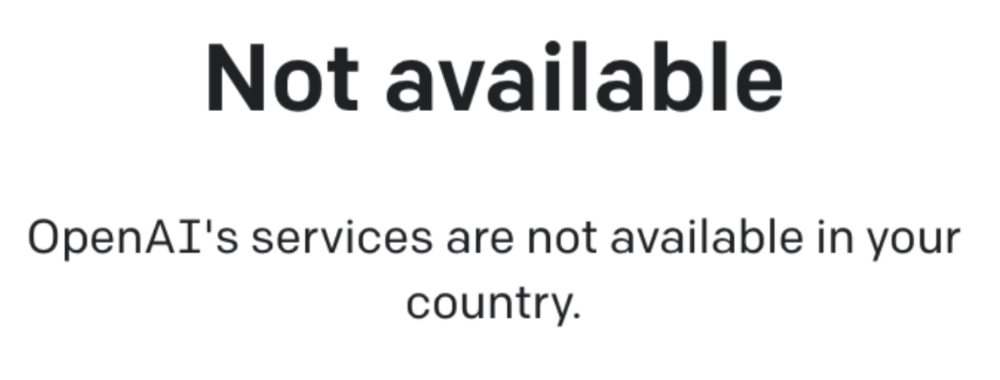
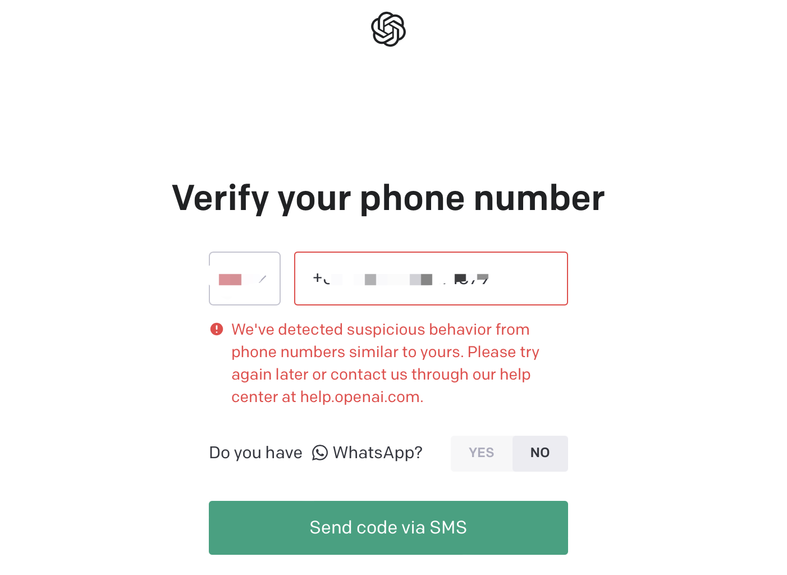
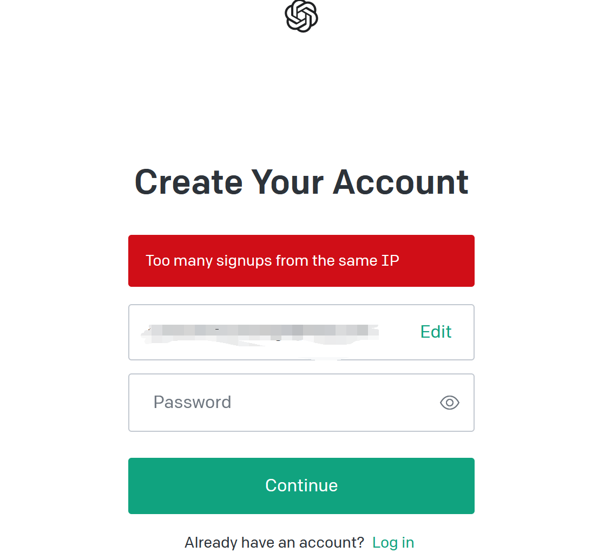
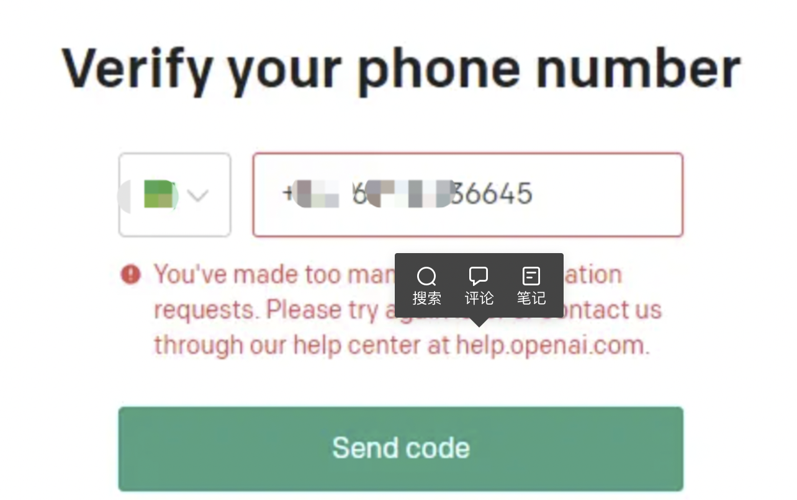

<h1 class="article-title no-number">常见问题汇总</h1>

#### ❓OpenAI's services are not available in your country.

- 翻译：OpenAI的服务在你的国家不可用
- 办法：请出国到外国可用的国家！

#### ❓Signup is currently unavailable, please try again later.

- 翻译：当前注册功能不可用，请稍后再尝试！
- 办法：请换个国家尝试，或者稍后再试！

#### ❓We've detected suspicious behavior from phone numbers similar to yours. Please try again later or contact us through our help center at help.openai.com.

- 翻译：从你的电话中发现可疑行为。请稍后再试或者通过帮助中心与我们联系。
- 办法：换个号码，而且换个国家。

#### ❓too many signups from the same IP

- 翻译：当前IP有太多注册用户
- 办法：换个国家。

#### ❓You've made too many phone verificationrequests.

- 翻译：号码验证次数太多
- 办法：换个国家或号码，保证国家和号码一致。