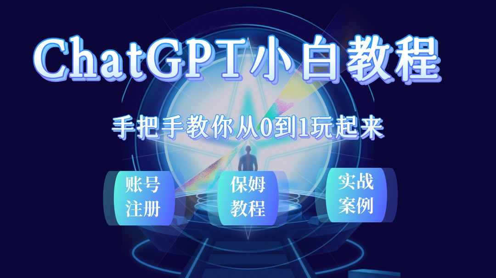

## 课程概述

课程目标：学习怎样在工作，生活中运用 ChatGPT。

适用人群：创业者、学生、程序员、管理者。

课程简介：本门课程通俗易懂带你入门 ChatGPT 的注册、使用和实战开发。

## 学习收获

- 了解人工智能和 ChatGPT

- 了解 ChatGPT 账号的注册和使用

- 学习 ChatGPT 实战开发

- 了解 ChatGPT 的应用场景

- 挖掘 ChatGPT 更多未知可能
